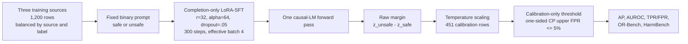
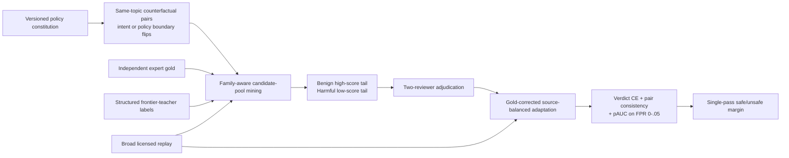
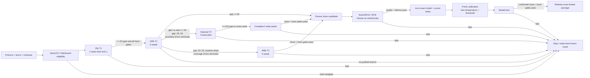

# Generalization Without Giving Up Specialization

## An evidence-grounded research proposal for Safety Guard Dynamics

**Repository snapshot reviewed:** 2026-08-01
**Primary artifact:** `papers/unified-report/`
**Scope:** training, KL-SFT, data construction, evaluation, benchmarks, inference, released evidence, stopped studies, and proposed/unrun work

> **Evidence boundary.** “Observed” means supported by committed repository artifacts. “Recomputed” means calculated from committed text-free score files during this review. “Proposed” means unrun. No proposed method below is presented as a demonstrated improvement.

> **Focused decision after a second review.** The active roadmap is now limited to **one fixed primary recipe** and **one conditional refinement**. The primary recipe is policy-conditioned counterfactual frontier distillation at meaningful scale: teacher-labeled data with a locked expert-adjudicated subset, matched policy/intent pairs, family-aware low-FPR hard-example mining, 25–50% broad replay, and an objective targeted at FPR `[0,.05]`. It is deliberately a locked composite, not an atomic algorithm: the primary contrast estimates the bundle's effect and makes no component-level causal claim. The conditional refinement is reasoning-active training on persistent boundary failures while retaining reasoning-free token scoring at inference. All other methods in the literature review are background or controls, not active work.

---

## 1. Executive Summary

The repository does **not** support the simple conclusion that KL regularization has no measurable effect. It supports a more useful and more restrictive conclusion:

1. Plain completion-only LoRA-SFT strongly specializes the four-model panel: represented-source macro-AP increases by **+0.323**, while held-out transfer macro-AP decreases by **−0.059** ([Paper A results](artifacts/paper_a_sft_v2/analysis/results.json)). At an equal empirical false-alarm budget, transfer recall falls from **0.517 to 0.217**, and HarmBench recall from **0.780 to 0.203** ([matched-FPR table](papers/unified-report/generated/tab_matched_fpr_gen.tex)).
2. KL-SFT at `beta=0.5` recovers **+0.061 transfer macro-AP** relative to an in-environment SFT rerun, but costs **−0.035 represented macro-AP** ([KL macros](papers/unified-report/generated/klsft_macros.tex)). The purpose-built-guard extension shows the same shape: estimated transfer preservation is **+0.047**, while represented performance costs **−0.034**; the predeclared `−0.02` non-inferiority condition fails ([adaptation results](artifacts/starting_type_adaptation_v1/analysis/results.json), [claim checks](artifacts/starting_type_adaptation_v1/analysis/claim_checks.json)).
3. KL is therefore acting as a **trade-off dial**, not producing a free generalization improvement. It constrains the same model on the same narrow supervised examples; it does not add missing task diversity, policy variation, difficult benign negatives, or new information about unseen domains.
4. The present implementation further weakens the intervention. It computes `KL(student || base)` over the **full vocabulary only at supervised completion positions**. For the Paper A one-token verdict, those positions are the verdict and EOS, so part of the penalty preserves formatting rather than the decision boundary. The reference forward is performed through `disable_adapter()` while the shared model remains in training mode, and the released KL artifacts do not retain achieved KL, loss curves, gradient ratios, adapter norms, or run metadata. The repository can measure output outcomes, but cannot diagnose optimization dynamics from its released evidence.
5. The largest root cause is not the absence of a better regularizer. It is the mismatch between a **1,200-row, three-source, balanced binary SFT objective** and the desired deployment quantity: robust recall near **5% FPR** under source, policy, attack-family, and domain shift. Cross-entropy on the gold next token is not an objective for partial AUC, calibration, or tail errors.
6. The best-supported pure-SLM hypothesis is one staged recipe, not a portfolio of optimizer tricks: start from the strongest eligible Qwen3.5-based 4B checkpoint, train on teacher-labeled data with expert-adjudicated gold subsets and policy/intent counterfactuals with low-FPR hard-example replay, and add selective reasoning supervision only if persistent boundary failures remain.

The recommended primary research target is:

> **A single-pass 3B–5B guard whose one-sided paired 95% upper confidence bound on the sealed-test TPR@5%FPR gap to GPT-5.4-low is at most 0.02, while retaining represented-source AP within 0.02 and meeting a locked local-serving budget.**

Beating GPT is a separate, harder gate. On committed ExpGuard, GPT-5.4-low reaches **0.896 TPR@5%FPR**, versus **0.787** for the best evaluated 1.5–4B base and **0.830** for Qwen3-32B base ([frontier table](papers/unified-report/generated/frontier_table.tex)). No repository experiment supports a “very high probability” of pure-SLM parity, and the available evidence cannot calibrate a numerical success probability. The honest claim is that the focused recipe below is the best-supported candidate for getting close. A frontier claim still requires a fresh sealed expert cohort, paired uncertainty, an identical FPR budget, and measured serving cost.

---

## 2. Current System Assessment

### 2.1 What the current system actually is



The model is not a conventional encoder classifier. It is a causal LM prompted to emit one verdict token. Training supervises the verdict plus EOS; scoring takes the last prompt-position logits for the `safe` and `unsafe` tokens and uses their difference ([trainer](experiments/run_paper_a_sft.py), [scorer](experiments/eval_paper_a_sft.py), [prompt contract](guard_research/prompts.py)).

### 2.2 Current training and data contract

| Component | Current implementation | Assessment |
|---|---|---|
| Models | Qwen2.5-1.5B, SmolLM2-1.7B, SmolLM3-3B, Qwen3-4B | Useful fixed panel; too small to identify family-wide architectural effects. |
| Adaptation | LoRA on attention and MLP projections, rank 32 | High adaptation capacity relative to 1,200 rows; plausible specialization pressure. |
| Update budget | 300 steps, effective batch 4 | Exactly 1,200 example presentations: approximately one pass, with no generalization-aware early stopping. |
| Training data | 200 safe + 200 unsafe from each of ToxicChat, prompt injection, and jailbreak classification | Perfect balance controls source/label frequency, but only three task surfaces and one coarse label. |
| Objective | Full-vocabulary completion CE | Misaligned with two-token ranking and low-FPR deployment metrics. |
| KL objective | `CE + beta KL(pi_theta \|\| pi_base)` on completion positions | Mathematically valid as a reverse-KL trust-region penalty, but incomplete as an anti-forgetting intervention. |
| Calibration | One positive temperature per model/condition/seed | Sound basic calibration primitive; calibration cohort is small and source-limited. |
| Threshold | Maximize calibration recall subject to a one-sided Clopper–Pearson FPR upper bound | Conservative and correctly calibration-only in the canonical pipeline. Matched-FPR paper analyses that use test negatives remain retrospective ROC summaries. |
| Core metric | Tie-aware non-interpolated macro-AP | Correct implementation and useful ranking summary, but not sufficient for a low-FPR deployment claim. |
| External domain set | ExpGuard, 2,275 expert-annotated finance/health/law prompts | Strongest repository evidence; gated and retrospective. |
| Mortgage set | Dual general-safety/mortgage-policy labels | Valuable task design; labels are LLM-judge/policy-card-consistent, not SME-adjudicated. |

Evidence: [config](configs/paper_a_sft.yaml), [public manifest](artifacts/paper_a_sft_v2/public_manifests/manifest.json), [audit](artifacts/paper_a_sft_v2/audit/audit.json), [metric implementation](guard_research/metrics.py), and [threshold implementation](guard_research/thresholds.py).

### 2.3 Data integrity and benchmark construction

The Paper A data engineering is stronger than the learning objective:

- The final train set has 1,200 rows, exactly balanced across three sources and two labels.
- Evaluation contains 677 represented rows, 1,580 transfer rows, 400 benign OR-Bench stress rows, and 200 harmful HarmBench stress rows.
- Exact train/evaluation overlap is zero. The prespecified 0.85 MinHash family threshold leaves zero cross-split pairs; a 0.80 sensitivity finds six pairs.
- Calibration is family-disjoint from all reported tests.
- One exact prompt carries conflicting labels across two **evaluation** sources, which is evidence of construct disagreement rather than train leakage.
- Lexical and upstream-family audits are implemented, but the report acknowledges that an embedding-space semantic-overlap audit is still absent.

This supports “dataset-source transfer after lexical/family decontamination,” not universal OOD generalization. The transfer sources may still overlap conceptually with training, model pretraining, or vendor guard training.

### 2.4 Observed result ledger

| Result | Observed value | What it licenses |
|---|---:|---|
| Plain SFT represented macro-AP movement | `+0.323` | Strong specialization to represented sources on this fixed panel. |
| Plain SFT transfer macro-AP movement | `−0.059` | Behavioral transfer loss on these held-out sources. |
| Plain SFT HarmBench recall movement | `−0.180` at own calibrated thresholds | Reduced harmful-prompt recall under one stress instrument. |
| Plain SFT matched-budget transfer recall | `0.517 -> 0.217` | The apparent own-threshold recall gain was purchased with more false alarms. |
| KL `beta=.5` vs in-env SFT, transfer | `+0.061` | KL measurably retains transfer on average. |
| KL `beta=.5` vs in-env SFT, represented | `−0.035` | The retention is not free. |
| Purpose-built panel KL preservation | `+0.047` | Same trade-off direction, analysis-preregistered estimate. |
| Purpose-built panel represented cost | `−0.034`; LCB `−0.062` | Fails the predeclared `−0.02` non-inferiority condition. |
| Base + SFT composition vs SFT, transfer | about `+0.075` | Keeping the base signal is more useful than a second SFT seed. |
| Composition vs base, transfer | about `+0.017` | Small edge, close to the report’s 0.015 environment-repeat noise floor. |
| GPT-5.4-low ExpGuard TPR@5%FPR | `0.896` | Current hosted frontier on inspected ExpGuard rows. |
| Best 1.5–4B base ExpGuard TPR@5%FPR | `0.787` | A gap of about 0.109 remains. |
| Qwen3-32B base ExpGuard TPR@5%FPR | `0.830` | Scaling alone does not close the gap. |

Sources: [Paper A claim checks](artifacts/paper_a_sft_v2/analysis/claim_checks.json), [KL summary](artifacts/klsft_v1/klsft_summary.json), [composition](artifacts/paper_a_sft_v2/analysis/composition/composition.json), [adaptation claim checks](artifacts/starting_type_adaptation_v1/analysis/claim_checks.json), and [frontier table](papers/unified-report/generated/frontier_table.tex).

### 2.5 Evidence quality by study

| Study | Current state | Main limitation for this proposal |
|---|---|---|
| Paper A SFT | Released retrospective estimation | Inspected fixed panel; no sealed test. |
| Base-adapter composition | Released retrospective estimation | Two-pass inference; small advantage over base. |
| KL-SFT v1 | Released retrospective estimation | No interval in the published analysis, no lock, and no run/optimization metadata in the repository. |
| Starting-type adaptation | Contract-drifted, analysis-preregistered | `dev_nonfinal`, skipped/failed eligibility preflights, post-outcome panel repair; not confirmatory. |
| ExpGuard | Released retrospective expert-labeled evidence | Gated, already inspected, no future confirmatory reuse. |
| Mortgage benchmark | Released development/synthetic evidence | No SME adjudication; policy-card consistency is not legal correctness. |
| Paper C matched DPO | Superseded/unrun scaffold | No claim-bearing adapter/result matrix. |
| Specialize-then-align Paper C | Stopped after pilot | Candidate inventories were initially 98% identical; primary panel never authorized. |
| Frontier-distilled SLM | Protocol plus committed 4,188-row text-free teacher preflight | No student has been trained or evaluated; the candidate pool is not authorized training data. |

The normative status source is [studies/registry.yaml](studies/registry.yaml). Any stronger claim must first repair the status and authorization chain, not merely rerun an analyzer.

---

## 3. Root Cause Analysis

### 3.1 Why plain SFT specializes

The training problem is easy to solve by learning dataset-specific shortcuts:

- Only three sources are present.
- Every source contributes exactly the same number of safe and unsafe examples.
- The only supervised semantic target is one bit.
- The represented tests are held-out rows from the same source families.
- Rank-32 adapters touch all major attention and MLP projections.

The endpoint is nearly source-owned: after SFT, represented macro-AP clusters around 0.98 across checkpoints whose bases ranged from 0.45 to 0.89. This convergence is consistent with a benchmark-specific attractor. It is **not** proof of hidden-representation collapse, because hidden states were not retained.

### 3.2 Why the current KL objective cannot create new generalization

The implemented objective is:

```text
L = CE_full_vocab(gold verdict and EOS)
    + beta * mean_t KL(p_student(. | x, gold_prefix_t) || p_base(. | x, gold_prefix_t))
```

Its behavior follows directly:

1. **No new support.** The KL is evaluated on the same 1,200 supervised examples. It cannot teach behavior on unseen policy formulations, benign trigger-word counterexamples, new domains, or new attacks.
2. **Position dilution.** Paper A verdicts are one token followed by EOS. KL is averaged across both supervised positions, so a material part of the penalty anchors EOS/formatting behavior after the gold verdict has already been teacher-forced.
3. **Distribution mismatch.** Evaluation uses a two-token margin, but KL uses the full vocabulary. Preserving probability mass over irrelevant next tokens is not identical to preserving the safe/unsafe boundary.
4. **Direction.** `KL(student || base)` is mode-seeking relative to the reference. It is a legitimate trust-region choice, but differs from the coverage-seeking `KL(base || student)` commonly used for distillation. The repository has not compared the directions.
5. **Teacher fallibility.** The base checkpoint is strong on transfer but often weak on represented sources. Anchoring it preserves both useful behavior and mistakes; no confidence- or correctness-aware weighting exists.
6. **Uncontrolled effective strength.** Only `beta in {0.5, 1.0}` is reported beyond zero. No achieved-KL target, CE/KL gradient ratio, per-layer drift, or development-selected non-inferiority frontier is available.
7. **Stochastic reference path.** The adapter-disabled reference is obtained from the same training-mode model during a second forward. The code does not explicitly force a deterministic evaluation-mode reference within the loss. Dropout may therefore contribute noise to the measured KL, depending on architecture and module settings.

The formulation is mathematically coherent as a local output constraint. The failure is that it is being asked to solve a data-coverage and objective-alignment problem.

### 3.3 What the outcome heterogeneity says

Recomputation from the four committed KL parquet files shows that `beta=.5` improves transfer AP on 15 of 16 model/source cells; the exception is Qwen2.5 on XSTest (`−0.010`). The size is highly heterogeneous: SmolLM2 loses about `−0.071` on WildJailbreak while gaining on its other three transfer sources. On represented sources, the largest costs concentrate in prompt injection and the smaller Smol models. At each model’s own calibrated threshold, KL also has mixed stress behavior: it lowers OR-Bench false alarms for three models but increases them for Qwen3-4B.

This pattern argues against a universal scalar `beta`. The correct intervention should adapt to source difficulty, reference reliability, and the low-FPR error set.

### 3.4 Optimization and forgetting diagnosis

| Candidate explanation | Verdict | Evidence |
|---|---|---|
| Catastrophic behavioral forgetting | **Supported** | Transfer AP and matched-budget recall fall after SFT; base+SFT composition recovers much of the loss. |
| Hidden representation collapse | **Unresolved** | No hidden-state probes, CKA/SVCCA, layer drift, or released checkpoints for KL runs. |
| Too little KL | **Unresolved** | Coarse beta grid; no achieved-KL/gradient diagnostics. |
| Too much KL | **Plausible for some models** | Represented AP costs grow from beta .5 to 1.0, while transfer often fails to improve further. |
| Objective mismatch | **Supported** | Full-vocabulary CE/KL on verdict+EOS is judged by two-token ranking and TPR@5%FPR. |
| Insufficient task diversity | **Supported** | Three training sources, one binary contract, no policy or domain-conditioning variation. |
| Dataset imbalance | **Not in the simple count sense** | Training is exactly balanced. Ecological prevalence and difficulty are not represented. |
| Benchmark leakage | **Lexical leakage substantially mitigated; semantic leakage unresolved** | Exact and 0.85-family overlap gates pass; 0.80 sensitivity and missing embedding audit remain. |
| Weak supervision | **Partly supported** | Labels are inherited binary source labels without rationale, policy, severity, or uncertainty. |
| Poor teacher quality | **Not applicable to ordinary SFT; relevant to KL reference and future distillation** | Current base anchor is not an expert teacher and can be wrong. |
| Evaluation bias | **Supported as a limitation** | Retrospective inspected sources, balanced AP, and some test-derived matched-FPR summaries; no fresh sealed cohort. |

---

## 4. Critical Weaknesses

### 4.1 The training target and release gate are different problems

The trainer optimizes next-token likelihood. The deployment claim is about the top 5% of negative scores. Improvements in average CE or AP need not improve this tail. The repository itself shows this: own-threshold transfer recall rises while pooled transfer FPR rises from 4.3% to 17.0%; when FPR is matched, recall collapses.

### 4.2 “Transfer” is too narrow

Current transfer means “not in the incremental SFT sources.” It does not establish:

- unseen policy generalization;
- temporal robustness to new attacks;
- multilingual or code-switched behavior;
- long-context or multi-turn robustness;
- response moderation;
- domain-policy composition;
- robustness to paraphrase, obfuscation, or value/intent manipulation; or
- production prevalence and calibration stability.

### 4.3 The KL study cannot explain its own mechanism

The released KL namespace contains text-free scores and a summary, but not the adapter bytes, run metadata, achieved KL, loss curves, gradient norms, or environment lock. This is sufficient for a retrospective outcome table, not for a researcher-level optimization diagnosis.

### 4.4 Selection data are missing

There is no dedicated development panel that is broad enough to choose beta, replay weight, pAUC weight, hard-negative schedule, or adapter interpolation without touching reported transfer sets. Future work needs explicit `candidate_pool`, `train`, `method_dev`, `calibration`, `sealed_validation`, and `sealed_test` roles. Rows promoted from `candidate_pool` into training must never remain in `method_dev` or any evaluation role.

### 4.5 The current binary contract discards useful structure

Safety is collapsed into `safe/unsafe`. The mortgage benchmark already demonstrates why this is inadequate: general safety and domain-policy intervention are orthogonal. Policy ID, severity, action, rationale spans, and ambiguity are useful auxiliary targets even when the deployed endpoint remains binary.

### 4.6 Frontier comparisons are development evidence

ExpGuard is valuable, but it is inspected. GPT emits a coarse integer risk score with ties; local guards emit continuous logit margins. The current comparison is not a sealed model-selection environment. It should guide hypotheses, not certify a win.

---

## 5. Literature Review: Methods That Fit This Repository

This review emphasizes 2024–2026 guard-specific work and includes older methods only when they map directly to an observed repository failure.

| Method / evidence | Why it matters here | Repository integration | Expected advantage | Complexity | Principal risk |
|---|---|---|---|---|---|
| [HarmAug (2024)](https://arxiv.org/abs/2410.01524) | Small distilled guards were limited by harmful-instruction diversity; targeted augmentation improved the student. | Extend the manifest builder with family-linked synthetic candidates, teacher labels, and a human-audited subset. | More support than KL can provide; good fit for a 3B student. | Medium–high | Teacher-correlated artifacts and unsafe synthetic-data governance. |
| [GuardBench (EMNLP 2024)](https://aclanthology.org/2024.emnlp-main.1022/) | Forty datasets expose how narrow a seven-benchmark suite is; comparable instruction models can rival specialized guards. | Use its source taxonomy to build a development-only breadth panel subject to the repository’s distribution ledger. | Better source diversity and leave-family-out evaluation. | Medium | Licensing, duplicate families, and benchmark heterogeneity. |
| [STAND-Guard (COLING 2025)](https://aclanthology.org/2025.coling-industry.1/) | Multi-task instruction tuning across moderation tasks targets unseen-task adaptation. | Add policy/task descriptors and balanced task sampling rather than pooling all sources behind one prompt. | Cross-task transfer without a larger backbone. | Medium | Negative transfer and inconsistent label semantics. |
| [PIGuard (ACL 2025)](https://aclanthology.org/2025.acl-long.1468/) | Benign examples containing attack trigger words expose over-defense; this matches the repository’s OR-Bench concern. | Mine safe counterfactuals near the 5% negative tail and add a trigger-preserving/intent-flipping objective. | Directly attacks false positives and shortcut learning. | Medium | False negatives if counterfactuals accidentally preserve malicious intent. |
| [SafeRoute (ACL Findings 2025)](https://aclanthology.org/2025.findings-acl.105/) | A router can use the small guard’s last-layer representation to identify cases where a larger guard helps. | Add a frozen hidden-state router beside the existing margin router; train only on development disagreements. | Better cost–quality frontier than escalating on margin alone. | Medium | Router overfit, global-FPR accounting, and hosted tail latency. |
| [ThinkGuard (ACL Findings 2025)](https://aclanthology.org/2025.findings-acl.704/) and [Safety Through Reasoning (EMNLP Findings 2025)](https://aclanthology.org/2025.findings-emnlp.1193/) | Structured critiques can enrich training signal and improve sample efficiency. | Distill critique/category/policy targets during training, but keep inference as the existing one-pass token score. | Richer supervision without autoregressive serving latency. | High | Rationale artifacts, teacher bias, and train–serve mismatch. |
| [Reasoning’s Razor (EACL 2026)](https://aclanthology.org/2026.eacl-long.190/) | Reasoning can improve average accuracy while hurting recall at low FPR; token scoring can beat verbal confidence. | Treat reasoning as a teacher/data-generation tool, not the default deployed guard. Preserve the current token-margin endpoint. | Avoids optimizing the wrong average metric. | Low | None if used as an evaluation constraint. |
| [Augmented Policy Training (ACL 2026)](https://aclanthology.org/2026.acl-long.748/) | Policy-conditioned guards overfit policy wording; perturbing policies improves unseen-policy generalization, with a reported 1B/8B comparison. | Add policy text/ID to prompt contracts and generate category deletion, paraphrase, merge/split, and boundary counterfactuals. | Direct match to the repository’s missing policy-shift axis. | High | Label validity under policy edits; policy injection attack surface. |
| [HaloGuard 1.0 (2026)](https://arxiv.org/abs/2607.02079) | A Qwen3.5-based 0.8B/4B family reports strong open-guard results after constitution-driven, paired-counterfactual training on about 1.26M rows. | Add its 4B checkpoint as a locally verified warm-start candidate and borrow the boundary-pair construction principle, not its reported metric. | Best new evidence that data geometry can dominate parameter count. | Medium for scoring; high for reproduction | Fresh single-team preprint, no ExpGuard result, and internal metric inconsistencies. |
| [DT-Guard (2026)](https://arxiv.org/abs/2607.06326) | A 4B guard uses intent/category reasoning during training and structured-label inference, with rollout-guided hard-case repair. | Admit only persistent boundary failures after T1; keep this repository's one-forward token margin at inference. | Possible final-mile discrimination without runtime CoT. | High | New preprint; F1 evidence may not transfer to TPR@5%FPR. |
| [LS-Guard (ACL Findings 2026)](https://aclanthology.org/2026.findings-acl.989/) | Shared and subject-specific LoRA experts with orthogonality address general-versus-specific features explicitly. | Split a central general adapter from trusted domain/policy adapters; route only by known metadata initially. | Specialization without forcing one adapter to encode every domain. | High | Routing leakage, extra memory, and unproven low-FPR behavior. |
| [FlexGuard (ACL 2026)](https://aclanthology.org/2026.acl-long.263/) | Continuous risk and strictness-specific thresholds expose the brittleness of fixed binary moderation. | Add ordinal severity/risk as an auxiliary target while keeping raw margins and calibration. | Better calibration and policy-specific operating points. | High | Severity annotation cost and threshold proliferation. |
| [Contrastive representation safety (2025)](https://arxiv.org/abs/2506.11938) | Triplet learning plus adversarial hard negatives explicitly separates benign/harmful representations. | Add a projection head on the last prompt token during training; discard it after training if the token head suffices. | Targets representation geometry rather than only output imitation. | Medium–high | False-negative mining and objective conflict with CE. |
| [DoRA (ICML 2024)](https://research.nvidia.com/publication/2024-07_dora-weight-decomposed-low-rank-adaptation) and [PiSSA (NeurIPS 2024)](https://papers.nips.cc/paper_files/paper/2024/hash/db36f4d603cc9e3a2a5e10b93e6428f2-Abstract-Conference.html) | They improve PEFT capacity/initialization, but the repository’s problem is excessive specialization, not failure to fit represented data. | One controlled adapter ablation after the data/objective studies. | Possible stability or efficiency gain. | Low–medium | More adaptation capacity may worsen forgetting. |
| [R-Drop (NeurIPS 2021)](https://proceedings.neurips.cc/paper_files/paper/2021/hash/5a66b9200f29ac3fa0ae244cc2a51b39-Abstract.html) | The current LoRA dropout creates stochastic submodels; consistency can reduce that variance. | Two student forwards with symmetric two-verdict KL; no base reference required. | Simple robustness/stability ablation. | Medium, roughly 2x training forward cost | Consistency can reinforce wrong predictions. |
| [WiSE-FT (CVPR 2022)](https://openaccess.thecvf.com/content/CVPR2022/html/Wortsman_Robust_Fine-Tuning_of_Zero-Shot_Models_CVPR_2022_paper.html) | Base/fine-tuned weight interpolation targets the exact robustness–specialization tension. | Merge base and LoRA updates once after development selection; one inference pass. | Composition-like retention without two-pass serving. | Low | Weight interpolation may not reproduce output composition in decoder LMs. |
| [Partial-AUC optimization (ICML 2022)](https://proceedings.mlr.press/v162/zhu22g.html) | The desired operating point is FPR `[0,.05]`, not average CE. | Add a batch-aware one-way pAUC/CVaR ranking term using a source-balanced memory queue. | Direct objective alignment. | Medium–high | Small batches and unstable tail estimates. |
| [SAM (ICLR 2021)](https://openreview.net/forum?id=6Tm1mposlrM) | Flat-minimum optimization is a plausible generalization regularizer. | Apply only to LoRA parameters as an ablation after a stable baseline. | May improve source robustness without a base teacher. | Medium, about 2x optimizer cost | Compute and hyperparameter sensitivity; weak guard-specific evidence. |

### Methods not recommended as first-line experiments

| Method family | Decision | Reason |
|---|---|---|
| DPO, IPO, ORPO, SimPO, KTO | Defer | With one hard binary label and a one-token verdict, these mostly reparameterize a margin loss; they add little information. The repository’s own Paper C design reaches the same conclusion and remains unrun. |
| GRPO / reinforcement learning | Defer | Expensive, proxy-sensitive, and unnecessary until a richer policy/reasoning reward and stable low-FPR evaluator exist. |
| Label smoothing / adaptive weight decay | Control only | These may reduce confidence or update size, but do not add missing source support and are not targeted to the 5% FPR tail. Do not allocate a standalone arm in this campaign. |
| Mixup / Manifold Mixup | Defer | Interpolating binary safety labels or unrelated prompt representations has no guaranteed policy meaning. Reconsider only with verified same-family counterfactual pairs and a layer-specific hypothesis. |
| QLoRA and more aggressive quantized training | Infrastructure option | Quantization can reduce training memory, but it is not a generalization intervention. Use it only if it preserves the BF16 recipe within the locked quality and calibration margins. |
| EWC / Fisher regularization / continual-learning penalties | Lower priority than replay | They require a representative reference distribution and a trustworthy Fisher estimate; on this small adapter-only update, direct replay/logit/representation anchors test the same retention hypothesis more transparently. |
| Self-distillation from the current student or equal-weight teacher ensembles | Do not prioritize | They cannot reliably add information beyond the current error set. T1 instead uses stronger teacher signals plus independent expert adjudication and reports teacher-correlated errors. |
| Test-time adaptation | Do not use in the primary guard | Adversarial user traffic can poison online updates; drift would invalidate calibration and the evidence lock. |
| Domain-specific tokenization | Do not prioritize | The endpoint is already a one-token verdict; data semantics, not token fragmentation, dominate the observed failure. |
| MoRA / higher-rank adapters | Low-priority capacity control | Represented data are already nearly saturated; more rank attacks the wrong bottleneck. |
| Equal-weight committees / seed ensembles | Do not repeat as primary | Repository experiments did not close the GPT gap and add serving cost. |
| Retrieval alone | Use only for policy-conditioned studies | Retrieval can supply current policy context, but does not solve general harm recognition and introduces retrieval/injection failure modes. |

**Selection conclusion.** HarmAug, APT, HaloGuard, DT-Guard, and low-FPR optimization converge on the two active choices in Section 6: improve task support and boundary supervision at scale, then optionally internalize structured reasoning only for persistent hard cases. The other rows remain useful context but receive no experiment budget in this proposal.

---

## 6. Recommended Improvements

### 6.1 Model decision: two trainable checkpoints only

| Role | Checkpoint | Why it is in scope | Evidence boundary |
|---|---|---|---|
| Primary general-purpose start | [`Qwen/Qwen3.5-4B`](https://huggingface.co/Qwen/Qwen3.5-4B), post-trained with thinking disabled | Current 4B Qwen generation and the post-trained parent used in the HaloGuard lineage. Unlike HaloGuard, it is not already specialized to this guard recipe, so it provides the cleaner of the two adaptation starts. | This is not the pretraining-only `Qwen3.5-4B-Base`, and prior post-training remains a confound. It is not evaluated in this repository; choosing it is an evidence-informed inference, not a measured superiority claim. |
| Warm-start challenger | [`astroware/HaloGuard1-Gen-4B`](https://huggingface.co/astroware/HaloGuard1-Gen-4B) | Qwen3.5-based guard reportedly trained on 1.26M constitutional examples with paired intent-flip counterfactuals. It may begin much closer to the target and need less adaptation. | Very recent single-team release, not locally evaluated. Its report/model card contain inconsistent 4B FPR summaries (`3.5%` versus `4.7%`) and contradictory multilingual summaries. |

Keep `HuggingFaceTB/SmolLM3-3B` base as a **frozen repository control**, not a third training track: it is the best directly measured at-most-4B checkpoint on ExpGuard (`0.787` TPR@5%FPR, `0.9561` AP). Its same-architecture SFT serving cell has a committed 20.1 ms batch-16 A100 P50; the base checkpoint itself must be re-benchmarked in M0 rather than assigned that latency. Run the two Qwen3.5 candidates and this frozen control through the same scorer on permitted method-development sources. Promote only one Qwen3.5 starting point after the 25k pilot and lock it before larger-scale training. Do not begin from the repository's ordinary-SFT adapters, which reduce ExpGuard performance.

Do not add `Qwen3Guard-Gen-4B` as a third track: it is already measured locally at `0.777` TPR@5%FPR, below the SmolLM3 control. The repository's Qwen3-8B base also trails its 4B peers at `0.748`, while Qwen3-32B reaches only `0.830`; neither result supports spending this focused campaign on older-family scale rather than the Qwen3.5 pair.

### 6.2 Technique 1 — policy-conditioned counterfactual frontier distillation

This is the primary fixed recipe and should receive almost all engineering, generation, adjudication, and training budget. Its total effect is the contrast with the frozen start. The same-row verdict-CE control diagnoses whether the structured targets and low-FPR objective add value after the new data have already been supplied; it does not estimate the counterfactual/mining/replay contribution or identify any single ingredient. Do not add a component factorial during this campaign.



The locked ingredients in the composite recipe are:

- structured teacher targets for intent, policy/category, severity/risk order, and final verdict;
- independent gold that overrides teacher labels and concentrates on disagreements and boundary cases;
- expert-validated same-topic pairs that hold vocabulary/topic approximately fixed while changing intent or policy applicability;
- benign examples from the model's high-risk tail and harmful examples from its miss tail;
- family/source quotas so one attack generator cannot dominate;
- 25–50% broad replay in every batch; and
- a verdict loss plus a batch-aware partial-AUC/ranking term targeted at FPR `[0,.05]`.

“Expert-adjudicated” does not mean that every row is manually labeled. The lock must require two-reviewer adjudication for every admitted teacher/student disagreement, hard-tail example, and uncertain counterfactual-identity case, plus a stratified random audit of the teacher-only stratum sized to estimate its label-error rate. The protocol freezes the sampling fractions and counts before collection; gold overrides teacher labels, and unresolved rows are excluded.

This directly addresses the repository's observed failure: narrow binary SFT learns source shortcuts and loses low-FPR transfer. It is also the common mechanism behind the most relevant recent results: HarmAug expands harmful support, APT perturbs policies for unseen-policy transfer, [Qwen3Guard](https://arxiv.org/abs/2510.14276) and HaloGuard use roughly million-row safety corpora, and HaloGuard reports exhaustive boundary counterfactuals plus explicit false-positive control.

The earlier `2k -> 8k -> 32k` ladder is too small for a high-confidence frontier attempt. Use `25k -> 100k -> 400k`, stopping at each gate. The lower rung is a feasibility screen informed by APT, which augmented 24,096 original examples into a 48,192-row training set through policy-category deletion and guideline editing. The larger rungs acknowledge that recent high-performing 4B guards report training on roughly 0.8–1.26M structured examples. Data quality and family independence matter more than reaching the largest count.

The repository's existing 4,188-row text-free teacher pool is **preflight evidence only**, not the first 4,188 rows of the new rung. Its `openai_moderation` tier has measured teacher AUC `0.9512`, while `beavertails` is `0.7343`, trips the proposed `0.80` source gate, and carries a noncommercial license ([preflight](docs/frontier-distillation-prereg.md)). Admit neither source automatically. Each must pass the new candidate-pool lineage, quality, current provider-terms, and intended-distribution lock; otherwise exclude it.

KL is not a separate research arm. If forgetting appears during the pilot, use a small deterministic two-verdict replay anchor as an implementation detail, selected by the represented non-inferiority gate. Do not run a broad KL-direction or representation-loss factorial.

Keep rank-32 LoRA as the fixed adaptation mechanism for this campaign. The repository already shows that it has enough capacity to fit the represented task; changing to full-parameter tuning would add a second capacity experiment without addressing the missing-support problem. If the 25k runs underfit even the represented data, stop and redesign rather than silently switch tuning regimes.

### 6.3 Technique 2 — selective boundary reasoning supervision, only if needed

Use this only if the 100k Technique 1 student improves by at least `0.03` TPR@5%FPR over the selected checkpoint's frozen pre-adaptation score and remains more than `0.02` and no more than `0.04` behind GPT on one-time development validation.

- Generate short structured `intent -> policy category -> verdict` traces only for borderline examples, persistent misses, and repeated-rollout disagreements.
- Use repeated teacher/student rollouts to partition examples into mastered, persistently failed, and unstable sets.
- Apply targeted supervised repair to persistent failures. A preference loss is permitted only for genuinely unstable pairs with distinct candidates and independent labels; it is not a default arm.
- Keep inference reasoning-free: one model forward and the `unsafe-safe` token margin. Reasoning's Razor directly warns that inference-time reasoning can reduce recall at low FPR.
- Treat the July 2026 DT-Guard result as motivating preprint evidence, not proof on this repository's matched-FPR target.

Current OpenAI service terms define a limited exception for classifiers that are not distributed or made commercially available to third parties. Provider terms, intended distribution, and model-output rights must therefore be resolved before any teacher collection; this proposal is research design, not legal authorization.

### 6.4 What is explicitly out of scope

No corrected-KL sweep, DoRA/MoRA comparison, SAM/R-Drop study, DPO/GRPO, model-soup or cross-checkpoint merging, multi-adapter experts, learned router, or committee belongs in the active roadmap. Routine merging of the selected LoRA adapter into its own base for packaging is an implementation step, not a research arm. Those excluded methods either attack the wrong bottleneck, lack guard-specific low-FPR evidence, or already failed to close the repository's frontier gap. A GPT cascade may be a deployment fallback, but it is not a pure-SLM result and is not one of the two techniques.

---

## 7. Ranked Research Roadmap

Define one **training-cell equivalent (TCE)** as one 300-step LoRA run for one checkpoint and seed under the Paper A recipe. This is an update-count planning unit, not a GPU-hour equivalent: structured targets and newer backbones can cost more per step. It avoids inventing hardware-hour estimates absent from the KL release; M0 and the 25k rung must replace it with measured throughput and GPU-hours before scale is authorized.

| Rank | Experiment | Decision role | Expected impact | Engineering effort | Comparative evidence | Compute |
|---:|---|---|---|---|---|---|
| 0 | M0: score Qwen3.5-4B and HaloGuard-4B against frozen SmolLM3 | Model gate, not a technique | Decisive eligibility information | Low–medium | Required prerequisite | Inference plus tiny nonfinal LoRA smoke |
| 1 | T1: policy-conditioned counterfactual frontier distillation | Primary fixed recipe | Potentially large | High, data/adjudication-bound | Strongest active hypothesis; closeness uncalibrated | 25k gate, then conditional 100k/400k scale |
| 2 | T2: selective boundary reasoning supervision | Conditional refinement | Potentially small final-mile gain | Medium–high | Weaker and conditional | Three-seed screen, then five total seeds only after entry gate |

There is no honest evidence for assigning a “very high” probability to GPT parity. The ranking expresses comparative confidence: T1 is the best-supported pure-SLM intervention; T2 is admitted only when T1 is already close enough for a modest final-mile gain to matter.

---

## 8. Experimental Design

### Shared evaluation contract for all experiments

Every experiment must report:

- tie-aware macro-AP and AUROC;
- TPR and one-way partial AUC over FPR `[0,.05]`;
- calibration-frozen test TPR/FPR;
- Brier score and NLL before/after calibration;
- precision and false alerts at unsafe prevalences `0.1%, 1%, 5%, 10%`;
- OR-Bench-style benign FPR and HarmBench-style recall;
- source, policy, attack-family, domain, language, and counterfactual slices when present;
- invalid/timeout/refusal rate;
- batch-1 and batch-16 P50/P90/P99 latency, throughput, memory, and cost;
- five seeds for claim-bearing trained arms; and
- paired family-aware uncertainty with seed identity preserved across sources.

The 25k bundle screen compares full T1 against both its frozen starting checkpoint and a same-start, same-row verdict-CE diagnostic control. In the following criterion, `delta` is full T1 minus the frozen start:

```text
LCB97.5(delta transfer TPR@5%FPR) > 0
AND LCB97.5(delta represented macro-AP) > -0.02
AND no preregistered stress harm margin is crossed.
```

The requested **very-close** gate has separate development and confirmatory meanings:

```text
Development screening gate (descriptive point estimate):
TPR_GPT@5%FPR - TPR_student@5%FPR <= 0.02.

Fresh sealed confirmed-close gate (paired non-inferiority statement):
UCB95(TPR_GPT@5%FPR - TPR_student@5%FPR) <= 0.02.

Against the current retrospective GPT value 0.896, this corresponds to >=0.876,
as a development point estimate only. The final comparison uses GPT rescored on
the same fresh rows and family-aware paired uncertainty.
```

At 100k and 400k, compare the locked full recipe with its frozen start and previous rung. Do not imply a same-size CE contrast that was not budgeted; the only direct bundle-versus-CE estimate is the 25k screen.

Final frontier-beating success remains stricter:

```text
On a fresh sealed expert-labeled cohort:
LCB95(student - GPT-5.4-low, TPR@5%FPR) > 0,
with the same row set, tie convention, policy, and global FPR budget;
single-pass student P50 <= 50 ms and P99 <= 150 ms at batch 16 on the locked A100 baseline;
batch-1 and target-production hardware reported separately;
no release gate fails.
```

The 50 ms local P50 gate is numerically about 31x below the current 1,553 ms hosted P50, but this is not an apples-to-apples speedup measurement: the local value is batch-16 A100 serving, while the hosted value includes provider infrastructure and was measured under a different concurrency/network regime. Report the numeric ratio only as context. Freeze the local gates after M0 and before training; no result may loosen them.

### M0 — Model/scorer eligibility gate

| Field | Design |
|---|---|
| Hypothesis | At least one Qwen3.5 start yields a valid, stable one-forward score, supports the fixed LoRA/backprop path, and fits the local serving envelope; zero-shot superiority over SmolLM3 is not required at this gate. |
| Rationale | HaloGuard is promising but new and internally inconsistent; Qwen3.5-4B is unmeasured here. Neither can be promoted from external F1 tables. |
| Implementation | Add pinned Qwen3.5 and HaloGuard prompt/scoring contracts, then score both plus frozen SmolLM3 on permitted method-development sources with next-token `unsafe-safe` margins. For each Qwen3.5 start, run a tiny nonfinal five-step LoRA smoke on permitted fixtures, verify finite loss and gradients in the intended hybrid-architecture target modules, merge/reload, and rescore a fixed parity set. Use no sealed data. |
| Required changes | Extend `guard_contracts.py`, model registry, revision locks, Qwen3.5/DeltaNet LoRA target mapping, runtime and merge/reload tests, invalid-output handling, and latency harness. |
| Compute | Three inference passes plus two five-step nonfinal LoRA smoke runs. |
| Expected outcome | One or two eligible trainable starting points and a trustworthy frozen baseline. |
| Metrics | TPR/pAUC at 1%, 2%, 5% FPR, AP, invalid rate, per-source worst case, batch-1/16 latency and memory. |
| Risks | Qwen3.5 runtime drift; HaloGuard report mismatch; source-specific model selection. |
| Success | Distinct single-token verdict IDs; >=99.9% finite margins; nonzero margin variance and AUROC >=0.55 on every mixed-label method-development source; finite smoke loss/gradients; merge/reload parity within a numerical tolerance locked before candidate scoring; and batch-16 A100 P50 <=50 ms and P99 <=150 ms. Report each candidate's ratio to the re-benchmarked SmolLM3 base, but do not use a second latency gate. If both fail, retain SmolLM3 and revisit the model choice before data collection. |

### T1 — Policy-conditioned counterfactual frontier distillation

| Field | Design |
|---|---|
| Hypothesis | Teacher supervision with a locked expert-adjudicated gold subset, plus policy/intent counterfactuals, broad replay, and a top-negative ranking loss, can reduce the GPT gap to <=0.02 TPR@5%FPR without sacrificing specialization. |
| Rationale | This adds missing support and trains the deployed operating region; ordinary SFT and KL do neither. Recent successful guards use strategic policy perturbations or hundreds of thousands to >1M structured examples. |
| Implementation | Build nested `25k -> 100k -> 400k` training rungs with fixed family IDs: the 25k set is a subset of 100k, which is a subset of 400k, and every training family remains disjoint from evaluation. At 25k, for every M0-eligible start, run the data-matched verdict-CE control and full T1 with the same 3 seeds; the locked adjudication sample supplies gold overrides. Select the start by a preregistered equal-source low-FPR score among candidates that pass all harm and latency gates, breaking a statistical tie by lower latency. Lock that start before 100k. Mine hard examples only from a dedicated `candidate_pool`; adjudicated rows promoted to training are removed by family from every evaluation role. Never mine `method_dev`, calibration, or sealed rows. Preserve paired seed identities and data order, and freeze each rung before scoring. Use 5 seeds at promoted rungs. |
| Required changes | Policy and teacher schemas, counterfactual identity validator, candidate miner, source-balanced sampler, top-negative queue/pAUC loss, Qwen3.5 trainer, and lock/package flow. |
| Compute | Approximate one-pass cost: 25k is 20.8 Paper-A TCE per run; 100k is 83.3; 400k is 333.3. The maximum 25k screen (2 starts x 2 arms x 3 seeds) is about 250 TCE; if M0 rejects one start, it is about 125 TCE. Five 100k full-method runs are about 417 TCE; five 400k runs are about 1,667 TCE. Measure GPU-hours during the 25k rung before authorizing scale. |
| Expected outcome | Better alignment with the observed failure than ordinary SFT/KL and the strongest current pure-SLM hypothesis for getting within 0.02 of GPT; the success probability is not calibrated and parity remains uncertain. |
| Metrics | Shared contract plus pair consistency, teacher/gold disagreement, data-source learning curves, and low-FPR tail composition. |
| Risks | Invalid synthetic pairs, teacher-policy imitation, provider/licensing restrictions, selection bias, and data volume overwhelming quality. |
| Success | 25k: full T1 beats its same-start CE control in every seed and by >=0.02 TPR@5%FPR on the prespecified aggregate. 100k continuation: GPT gap <=0.04, gain from 25k >=0.015, represented and broad-transfer AP >= base-0.02. Authorize 400k only when the remaining gap is `(0.02, 0.04]`, the learning-curve slope is positive, residual errors are dominated by missing coverage rather than boundary confusion, and no stress harm appears. Stop for a gap >0.04. |

### T2 — Selective boundary reasoning supervision

| Field | Design |
|---|---|
| Hypothesis | Short intent/category/verdict traces on persistent boundary errors improve latent discrimination while reasoning-free token scoring preserves low-FPR latency and recall. |
| Rationale | DT-Guard reports a related reasoning-active/reasoning-free design; Reasoning's Razor makes autoregressive reasoning at inference the wrong path for this operating point. |
| Entry gate | Run only if the frozen 100k T1 student has improved by >=0.03 TPR@5%FPR over the selected checkpoint's frozen pre-adaptation score and remains `(0.02, 0.04]` behind GPT on one-time development validation. |
| Implementation | Generate three structured rollouts for eligible hard examples; split mastered, persistent-failure, and unstable cases. Apply targeted SFT to persistent failures. Compare T1 versus T1+selective-reasoning under identical data and seeds. |
| Required changes | Structured-trace schema, rollout-consistency analyzer, span-weighted training loss, and strict reasoning-off scorer parity test. |
| Compute | Begin with a 3-seed pilot on the frozen T1 starting point; expand to 5 total prespecified seeds only if every pilot seed improves. Exact TCE depends on the admitted hard-case count and is locked after mining. |
| Expected outcome | Modest extra boundary gain; lower confidence than T1 and unlikely to rescue a large remaining gap. |
| Metrics | Shared contract, persistent-error repair rate, unstable-pair rate, generated-token count at inference (must remain zero), and latency parity. |
| Risks | Rationale artifacts, train/serve mismatch, preference noise, and average-F1 gains that disappear at 5% FPR. |
| Success | Pilot gate: >=0.015 TPR@5%FPR gain over frozen T1 in all 3 initial seeds. Promotion gate after completing 5 total seeds: the shared uncertainty/harm criteria pass, the descriptive development GPT gap is <=0.02, and inference remains one forward with <=5% latency regression. A gain that misses the development close gate is useful evidence but does not promote the method. |

---

## 9. Expected Impact

These are directional expectations, not forecasts.

| Intervention | Represented specialization | Source transfer | Policy transfer | Low-FPR behavior | Serving cost |
|---|---|---|---|---|---|
| T1: policy-conditioned counterfactual frontier distillation | Maintain if replay gate works | Best-supported, unvalidated | Best-supported, unvalidated | Directly targeted; unvalidated | One inference pass; training/data cost only |
| T2: selective boundary reasoning supervision | Maintain | Small–moderate incremental gain | Moderate | Uncertain until matched-FPR test | No inference reasoning; one pass |

A realistic target is first to reach the `<=0.02` close gate, not to promise a win. T1 is more directly aligned with the observed failure than ordinary SFT/KL, but its chance of reaching the close gate is uncalibrated and uncertain because no cited study demonstrates that result on fresh ExpGuard-style expert data at matched 5% FPR. T2 is a conditional attempt to recover the final boundary gap, not a rescue plan for a weak T1 result.

---

## 10. Risks and Trade-offs

| Risk | Consequence | Mitigation |
|---|---|---|
| Teacher contamination or shared benchmark knowledge | Apparent frontier gain without new generalization | Independent expert gold, source lineage, fresh families, teacher-blind test. |
| Synthetic shortcut artifacts | Student learns generator style | Multiple generators, style audits, family grouping, human validation, real-data holdouts. |
| Hard-negative label noise | Tail objective amplifies mistakes | Two-reviewer adjudication, ambiguity label, do-not-train unresolved rows. |
| Policy edits change intended labels | Invalid counterfactual supervision | Mechanical and expert validation; report pair identity rates before training. |
| Low-FPR instability | Favorable point estimate from few negatives | Simulation-derived sample size and enough independent negative families. |
| Calibration leakage | Optimistic deployment metrics | Separate method-dev, calibration, validation, and test roles. |
| New Qwen3.5/HaloGuard runtime or report drift | Candidate cannot be reproduced or its external numbers are misleading | M0 scorer/latency gate, pinned revisions, and no borrowing of external metrics. |
| Provider-output restrictions | Student cannot be distributed or commercialized as intended | Resolve terms and intended distribution before teacher collection; use expert/open-teacher alternatives if necessary. |
| Reasoning supervision teaches rationale style | Average F1 improves while low-FPR recall degrades | T2 entry gate, direct token scoring, data-matched control, and matched-FPR promotion only. |
| Regulated-domain overclaim | Guard result mistaken for legal/compliance decision | Restrict to triage/audit; policy-card and SME boundaries in every artifact. |
| Research multiplicity | One lucky method promoted | Locked hypotheses, staged promotion, simultaneous intervals or prespecified FDR. |
| Runtime drift | Non-reproducible small effects | Supported Python/runtime lock, source snapshot, deterministic scorer, and pinned model revisions. |
| Latency regression | Accuracy method no longer deployable | One-pass primary path; benchmark actual merged/quantized artifact. |

---

## 11. Implementation Plan

### 11.1 Proposed namespace

Do not mutate Paper A or KL-SFT v1. Create a new study:

```text
configs/frontier_generalization_v1.yaml
docs/frontier-generalization-prereg.md
experiments/generalization/
  contracts.py
  prepare_data.py
  audit_data.py
  collect_teacher.py
  generate_counterfactuals.py
  mine_hard_cases.py
  collect_reasoning.py
  objectives.py
  train.py
  evaluate.py
  analyze.py
  package.py
tests/generalization/
artifacts/frontier_generalization_v1/
  LOCK.json
  RELEASE.json
  protocol/
  public_manifests/
  teacher/
  adjudication/
  scores/
  analysis/
  provenance/
```

### 11.2 Reuse existing seams

| Existing component | Reuse | Required extension |
|---|---|---|
| `guard_research.metrics` | Canonical AP/AUROC/Brier/NLL | Add partial-AUC and paired low-FPR helpers with tests. |
| `guard_research.thresholds` | Calibration-only threshold rule | Add explicit close/frontier contrasts and confidence reporting. |
| `guard_research.provenance` | Content/family hashes and MinHash | Add embedding-overlap sensitivity and synthetic lineage graph. |
| `paper_a_common.py` | Model revisions, prompt budgeting, lock conventions | Extract stable generic pieces; do not weaken Paper A validation. |
| `guard_contracts.py` | Native guard prompt/scoring patterns | Add pinned Qwen3.5 and HaloGuard safe/unsafe token contracts. |
| `run_paper_a_sft.py` | LoRA setup and fixed data order | Reuse mechanics only; implement source-balanced sampling and new losses separately. |
| `eval_paper_a_sft.py` | One-pass raw-margin scoring and temperature scaling | Add auxiliary score schema without changing the canonical Paper A output. |
| `eval_frontier_general_h2h.py` | Paired family-aware GPT comparison | Use only after freezing a fresh cohort and comparator contract. |
| Benchmark distribution ledger | License-aware publication gate | Register every new/synthetic/teacher source before collection. |

### 11.3 Mandatory run metadata

Every trained cell must retain:

- exact initial and final adapter hashes;
- objective name and all coefficients;
- verdict, pAUC/ranking, pair-consistency, replay, and optional reasoning loss traces;
- teacher model/vintage, prompt hash, output status, and gold-overwrite reason;
- counterfactual transformation, pair identity decision, and generation lineage;
- hard-example selection score, queue snapshot hash, and candidate-pool-to-train promotion record;
- gradient norms and per-loss gradient ratios at fixed steps;
- adapter norm and per-layer update norm;
- examples/tokens/families seen;
- truncation counts;
- wall time, GPU, peak memory, dtype, software fingerprint;
- reasoning-off inference assertion and safe/unsafe token identities; and
- failure state without silent replacement.

### 11.4 Promotion gates



---

## 12. Estimated Timeline

| Phase | Duration | Deliverable | Stop condition |
|---|---:|---|---|
| 0. Protocol, terms, and scorer gate | 1–2 weeks | Locked estimands, data roles, provider/distribution decision, Qwen3.5/HaloGuard scorer, five-step LoRA/merge smoke, and latency result | No teacher collection or claim-bearing training before lock; smoke runs use permitted fixtures only. |
| 1. Twenty-five-thousand-row T1 pilot | 3–5 weeks | Validated counterfactuals, adjudicated hard cases, two starting-point screen, three-seed full-method/control result | Stop if pair validity, agreement, source diversity, or >=0.02 gain gate fails. |
| 2. One-hundred-thousand-row T1 scale | 4–7 weeks | Five-seed learning curve and one-time development validation | Freeze if close; stop if gap >0.04 or scale gain <0.015. |
| 3a. Optional T2 boundary-reasoning pilot | 2–4 weeks | Staged three-seed screen, then five-total-seed T1 versus T1+T2 contrast | Run only under T2 entry gate; stop unless every pilot seed gains >=0.015, and promote only if the five-seed result reaches the close gate. |
| 3b. Optional 400k T1 scale | 5–9 weeks | Five-seed high-data student | Authorize only for a 0.02–0.04 gap, positive 25k-to-100k slope, coverage-dominated errors, and intact harm gates. |
| 4. Pre-sealed packaging and quantization | 1–2 weeks | Merged BF16 and candidate INT8 packages, method-development quality/latency comparison, one selected artifact with exact model/scorer bytes locked | Do not proceed if neither artifact meets the frozen quality and serving gates; never choose using sealed outcomes. |
| 5. Fresh calibration and sealed evaluation | 3–6 weeks | Locked temperature/threshold followed by expert-gold paired student/GPT confirmed-close and frontier contrasts on the exact release artifact | No method, model, scorer, quantization, calibration, or threshold change after unsealing. |
| 6. Release | Up to 1 week | Exact tested package, latency/cost report, model card, and text-free evidence release | Do not release if terms, confirmed-close, low-FPR, or other release gates fail. |

The schedule is dominated by data adjudication and sealed evaluation, not GPU training. Parallel engineering can shorten calendar time, but it must not allow test results to leak into method selection.

---

## 13. References

### Repository evidence

1. [Unified report source](papers/unified-report/unified_report.tex) and [PDF](papers/unified-report/unified_report.pdf).
2. [Paper A configuration](configs/paper_a_sft.yaml), [trainer](experiments/run_paper_a_sft.py), [evaluator](experiments/eval_paper_a_sft.py), and [analysis](experiments/analyze_paper_a_sft.py).
3. [Paper A manifest](artifacts/paper_a_sft_v2/public_manifests/manifest.json), [split audit](artifacts/paper_a_sft_v2/audit/audit.json), and [results](artifacts/paper_a_sft_v2/analysis/results.json).
4. [KL sweep](experiments/run_klsft_sweep.py), [KL analyzer](experiments/analyze_klsft.py), [summary](artifacts/klsft_v1/klsft_summary.json), and [score artifacts](artifacts/klsft_v1/scores/).
5. [Starting-type primary contract](artifacts/starting_type_adaptation_v1/protocol/primary_contract.json), [results](artifacts/starting_type_adaptation_v1/analysis/results.json), and [claim checks](artifacts/starting_type_adaptation_v1/analysis/claim_checks.json).
6. [Composition results](artifacts/paper_a_sft_v2/analysis/composition/composition.json).
7. [ExpGuard frontier table](papers/unified-report/generated/frontier_table.tex), [serving table](papers/unified-report/generated/frontier_serving_table.tex), and [GPT baseline](gpt-baseline/result.md).
8. [Mortgage build specification](docs/mortgage-benchmark-build-spec.md) and [study registry](studies/registry.yaml).
9. [Stopped Paper C status](studies/paper-c-specialize-align-mortgage-v1/STATUS.md) and [DPO candidate protocol](docs/paper-c-prereg-v2.md).
10. [Existing frontier-distillation preregistration](docs/frontier-distillation-prereg.md) and [unified proposal](papers/unified-report/proposal.md).

### External primary literature

11. Lee et al. [HarmAug: Effective Data Augmentation for Knowledge Distillation of Safety Guard Models](https://arxiv.org/abs/2410.01524), 2024.
12. Bassani and Sanchez. [GuardBench: A Large-Scale Benchmark for Guardrail Models](https://aclanthology.org/2024.emnlp-main.1022/), EMNLP 2024.
13. Wang et al. [STAND-Guard: A Small Task-Adaptive Content Moderation Model](https://aclanthology.org/2025.coling-industry.1/), COLING 2025.
14. Li et al. [PIGuard: Prompt Injection Guardrail via Mitigating Overdefense for Free](https://aclanthology.org/2025.acl-long.1468/), ACL 2025.
15. Lee et al. [SafeRoute: Adaptive Model Selection for Efficient and Accurate Safety Guardrails](https://aclanthology.org/2025.findings-acl.105.pdf), ACL Findings 2025.
16. Wen et al. [ThinkGuard: Deliberative Slow Thinking Leads to Cautious Guardrails](https://aclanthology.org/2025.findings-acl.704/), ACL Findings 2025.
17. Chegini et al. [Reasoning’s Razor](https://aclanthology.org/2026.eacl-long.190/), EACL 2026.
18. Liu et al. [Domain Generalizable AI Guardrails with Augmented Policy Training](https://aclanthology.org/2026.acl-long.748/), ACL 2026.
19. Liang and Liao. [LS-Guard](https://aclanthology.org/2026.findings-acl.989/), ACL Findings 2026.
20. Ding et al. [FlexGuard](https://aclanthology.org/2026.acl-long.263/), ACL 2026.
21. Simko et al. [Improving Large Language Model Safety with Contrastive Representation Learning](https://arxiv.org/abs/2506.11938), 2025.
22. Liu et al. [DoRA: Weight-Decomposed Low-Rank Adaptation](https://research.nvidia.com/publication/2024-07_dora-weight-decomposed-low-rank-adaptation), ICML 2024.
23. Meng et al. [PiSSA](https://papers.nips.cc/paper_files/paper/2024/hash/db36f4d603cc9e3a2a5e10b93e6428f2-Abstract-Conference.html), NeurIPS 2024.
24. Liang et al. [R-Drop](https://proceedings.neurips.cc/paper_files/paper/2021/hash/5a66b9200f29ac3fa0ae244cc2a51b39-Abstract.html), NeurIPS 2021.
25. Wortsman et al. [Robust Fine-Tuning of Zero-Shot Models](https://openaccess.thecvf.com/content/CVPR2022/html/Wortsman_Robust_Fine-Tuning_of_Zero-Shot_Models_CVPR_2022_paper.html), CVPR 2022.
26. Zhu et al. [When AUC Meets DRO: Optimizing Partial AUC for Deep Learning](https://proceedings.mlr.press/v162/zhu22g.html), ICML 2022.
27. Foret et al. [Sharpness-Aware Minimization](https://openreview.net/forum?id=6Tm1mposlrM), ICLR 2021.
28. Sangameswaran et al. [HaloGuard 1.0](https://arxiv.org/abs/2607.02079) and [HaloGuard1-Gen-4B model card](https://huggingface.co/astroware/HaloGuard1-Gen-4B), 2026.
29. Liu et al. [DT-Guard: Intent-Driven Reasoning-Active Training for Reasoning-Free LLM Safety Guardrail](https://arxiv.org/abs/2607.06326), 2026.
30. Qwen Team. [Qwen3.5-4B model card](https://huggingface.co/Qwen/Qwen3.5-4B), 2026.
31. Qwen Team. [Qwen3Guard Technical Report](https://arxiv.org/abs/2510.14276), 2025.
32. OpenAI. [OpenAI Services Agreement](https://openai.com/en-GB/policies/services-agreement/), effective 2026; see the current `Permitted Exception` definition before any output-based training.

---

## Prioritized answer: what to run first with limited engineering time

1. **Spend the first week on M0:** implement the same one-forward `unsafe-safe` scorer for Qwen3.5-4B and HaloGuard1-Gen-4B, run the five-step LoRA/merge smoke, and measure both against the frozen SmolLM3 control. This cheaply prevents months of training on an ineligible checkpoint. HaloGuard is the likely warm-start winner; Qwen3.5-4B is the less guard-specialized general-purpose start. The local result—not the external F1 table—chooses between them.
2. **Put nearly all remaining budget into T1:** policy-conditioned counterfactual frontier distillation with teacher labels, a locked expert-adjudicated gold subset, hard benign/harmful tails, 25–50% broad replay, and a top-negative/pAUC loss. Start at 25k examples. Scale to 100k only after the three-seed gain gate, and to 400k only if the learning curve and harm gates justify it.
3. **Run T2 only as a final-mile refinement:** if the 100k T1 student improves at least 0.03 over the selected frozen start but remains 0.02–0.04 behind GPT, add selective intent/category/verdict reasoning supervision on persistent boundary failures. Keep inference reasoning-free. If T1 remains more than 0.04 behind, T2 is unlikely to rescue it; stop and diagnose the data/model instead.

Do **not** spend this campaign on corrected-KL factorials, DoRA/MoRA, SAM/R-Drop, DPO/GRPO as a general recipe, model soups/cross-checkpoint merging, routing, or committees. None has a comparably strong mechanism or current evidence for closing a roughly 0.109 matched-FPR TPR gap.
