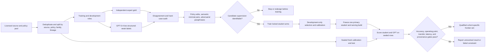

# Proposal: Adapting the guard — SFT and KL-SFT from purpose-built starting checkpoints

## Independent review verdict (v2)

*From a 5-agent review (2 fact/feasibility verifiers + 2 adversarial reviewers + synthesis). This rewrite is a clear improvement over the prior parent→guard lineage version, and its feasibility is confirmed.*

**Verdict: ADD, with changes — ship as a companion paper at MVP scope, not a new act now.** Making each released guard both the controlled starting checkpoint AND its own frozen KL reference gives genuinely controlled within-checkpoint deltas (shared weights, data, seeds, budget, scorer) — which the prior lineage design lacked — and the matched Qwen3-4B vs Qwen3Guard-Gen-4B block is a real same-architecture bridge. **Feasibility is confirmed:** the seven Paper A LoRA targets exist with compatible semantics in all five underlying architectures (Gemma2, Qwen3, Granite, Llama-3.2, Mistral-7B), and standard zero-init LoRA satisfies the step-zero-identity / initial-KL≈0 preflight architecture-independently. GPU is not the binding cost (~150–400 GPU-h, low hundreds of dollars); the real costs are engineering six model-native scorers + a generalized/locked KL trainer + a non-HARKing analyzer (~4–8 engineer-weeks; ~1–2 for a 3-family MVP), and — only for a prospective claim — the fresh SME cohort.

**Required before headline claims** (the three factual items are corrected inline in Sections 2/3/4.2):
- **LCBs are conditional on the fixed model panel.** The report's bootstrap resamples evaluation near-duplicate families + training seeds with model identities held fixed, so the one-sided 97.5% lower bounds for `H_gain`/`H_conc`/`H_preserve`/`H_cost` carry only eval-row+seed uncertainty — they cannot back an "over the entire panel" robustness reading, and one dominant family can drive them. Read the equal-family mean as a fixed-panel summary. *(corrected §3/§9)*
- **The 3-family minimum silently hinges on gated access:** only Qwen3Guard (0.6B+4B = one family) and Granite Guardian are cleanly ungated = **two** families; ShieldGemma, Llama-Guard-3-1B, and WildGuard are gated. Secure + snapshot at least one gated guard in Phase 0 and predeclare replacements. *(corrected §4.2)*
- **Within-checkpoint deltas are causal only for THIS recipe on THAT checkpoint** and are not comparable across panels (baseline/headroom differs). *(corrected §2)*
- **Ceiling/headroom confound:** purpose-built guards start near ceiling on represented sources, compressing `Δ_SFT(represented)` and confounding `H_conc`/`Γ`. Report headroom-normalized gains (`Δ/(1−AP_U)`) alongside raw AP and interpret `H_conc`/`Γ` jointly with `U`'s baseline.
- **Replace the post-hoc verdict:** land a non-HARKing analyzer (predeclared β=0.5 primary; locked predicate-driven language; a β=0≡vanilla unit test) before any general KL result enters the paper. `analyze_klsft.py` currently auto-selects best-β and writes the verdict after seeing results, and §10 still branches wording on the ungated point-estimate sign — both must be fixed.
- **Grandfather the running general KL-SFT sweep:** the new lock should CONSUME its adapters (bind their environment + step-zero/adapter hashes) and RE-SCORE under the new schema rather than retrain the general panel (first verify the launched betas were {0,0.5,1.0}). Also decide whether the general-panel KL cells stay as the Act I anti-forgetting control or move into this act — the same numbers must not appear under two narratives.
- **Fixed β=0.5 does not equalize regularization strength** across checkpoints; report achieved train/held-out KL beside every preservation cell and add a matched-achieved-KL sensitivity. Justify the mode-seeking `KL(π_θ‖π_ref)` direction or run the mass-covering direction as a locked sensitivity.
- **Keep the fresh SME cohort out of the MVP** (retrospective, estimation-only tier); it is the true calendar/dollar gate. Treat unrun Paper C v2 as a companion study with no reserved act, consistent with the governance decision below.

**Development started (this review turn):** the generalized, registry-driven adaptation harness — explicit `{unmodified, sft, kl_sft}` conditions (fixing the `condition=sft`+beta conflation), pluggable native-verdict contracts, and KL reference = the same starting checkpoint — is built in a new namespace and CPU-validated: [`configs/starting_type_adaptation_v1.yaml`](../../configs/starting_type_adaptation_v1.yaml), [`experiments/starting_type_common.py`](../../experiments/starting_type_common.py), [`tests/test_starting_type_adaptation.py`](../../tests/test_starting_type_adaptation.py). Guard-native contracts are registered stubs pending Phase-0 revision pinning.

---

## Revision decision

This proposal now follows the intended experiment:

1. score each released purpose-built guard without modifying it;
2. start from that exact released guard checkpoint and fine-tune it with ordinary SFT;
3. start again from the same released guard checkpoint and fine-tune it with KL-regularized SFT;
4. compare all three conditions with the same three conditions for the report's general instruction checkpoints; and
5. test whether the result depends on benchmark, scoring contract, prevalence, operating point, and domain.

The released guard is therefore not merely the endpoint of an opaque vendor lineage. It is the controlled starting checkpoint for our two adaptation methods.

| Starting checkpoint | Unmodified | Ordinary SFT | KL-SFT |
|---|---:|---:|---:|
| General instruction checkpoint | ✓ | ✓ | ✓ |
| Released purpose-built guard | ✓ | ✓ | ✓ |

This is the strongest version of the study because the main deltas are now under our control. For a purpose-built guard `G_i`, `G_i + SFT` and `G_i + KL-SFT` use the same starting weights, tokenizer revision, training rows, seed schedule, update budget, and scorer. The frozen KL reference is `G_i` itself.

Vendor parent-to-guard comparisons may still appear as descriptive background, but they are not the design backbone and cannot carry causal claims about vendor training.

## Working research question

> **When the same adaptation data and budget are applied to general instruction checkpoints and released purpose-built guards, does ordinary SFT produce the same specialization and ranking fragility, and does KL-SFT preserve more of the starting checkpoint's transfer behavior?**

A shorter manuscript-facing title is:

> **Adapting the guard: do purpose-built starting points specialize again?**

No act number should be assigned until the report's existing Act-II governance conflict is resolved. This document is a protocol proposal, not evidence that any hypothesis is true.

---

## 1. Why this design makes the report stronger

The current report has a careful controlled result for four general instruction checkpoints:

- one frozen 1,200-row training manifest;
- one common LoRA-SFT recipe;
- five seeds per trained checkpoint;
- one `safe`/`unsafe` research contract;
- family-aware paired evaluation; and
- represented-source, adaptation-held-out, stress, composition, and domain views.

The current report does not establish whether an already specialized guard reacts differently when it is adapted again. Merely scoring ShieldGemma, Qwen3Guard, Granite Guardian, Llama Guard, or WildGuard would improve practical coverage, but it would leave the central mechanism opaque: vendor data, objectives, compute, checkpoint selection, and post-training transformations are not controlled.

Directly adapting the released guard solves the tractable part of that problem. It supports three controlled questions:

1. Does ordinary SFT further concentrate an already purpose-built guard on the adaptation sources?
2. Does KL-SFT reduce that incremental concentration relative to ordinary SFT?
3. Is the adaptation response different for the fixed purpose-built panel than for the fixed general-checkpoint panel?

This design also produces a useful negative result if purpose-built guards are stable. If released guards retain broad transfer after the same SFT pressure that specializes general checkpoints, the original finding has a meaningful boundary. If they specialize again, the report gains evidence that benchmark dependence is not cured simply by beginning with purpose-built guard weights.

The expanded panel remains fixed and purposively selected. It is not a random sample of all guard models.

---

## 2. What is controlled, and what is not

### Controlled within each starting checkpoint

For every eligible starting checkpoint, hold fixed:

- exact model and tokenizer revisions;
- the frozen Paper A training manifest and row order for a given seed;
- training prompt and binary target contract;
- optimizer, learning rate, batch construction, LoRA rank/alpha/dropout, update steps, truncation, and completion masking;
- seeds `42–46`;
- evaluation rows, identities, family graph, calibration protocol, and score equations;
- hardware class and software environment within the primary comparison; and
- the starting checkpoint used as the KL reference.

Ordinary SFT and KL-SFT must be rerun in the same locked environment. The existing committed SFT scores may be used as a replication anchor, but an old SFT run and a new KL-SFT run must not be treated as the primary pair if their environments or execution sources differ.

### Not controlled across starting-checkpoint types

`starting_type ∈ {general, purpose_built}` is not randomized. The two panels differ in architecture, vendor, pretraining, alignment history, policy, scale, and checkpoint selection. The 2 × 3 table is therefore a **blocked comparative design**, not a randomized factorial experiment.

The primary within-checkpoint contrasts are:

- SFT minus unmodified;
- KL-SFT minus unmodified; and
- KL-SFT minus SFT at the same seed.

Each is causal only for the effect of *this locked recipe on that specific checkpoint*; it is **not** comparable across checkpoints or panels, because it is confounded by each checkpoint's baseline level (ceiling/headroom). A difference between the general and purpose-built panel averages is a fixed-panel descriptive interaction, not a causal starting-type effect. It may suggest that starting-point specialization matters, but it cannot identify “the causal effect of being purpose-built.”

### Claim vocabulary

Allowed:

> “Further adaptation with our fixed SFT protocol changed this released guard by …”

> “KL-SFT preserved more adaptation-held-out ranking than ordinary SFT for this starting checkpoint …”

Not allowed:

> “Vendor guard training caused the observed difference.”

> “Purpose-built models generally respond this way.”

---

## 3. Research questions and preregistered hypotheses

### RQ1 — Further specialization

When ordinary SFT starts from a released purpose-built guard, does it improve performance on the sources represented in our 1,200-row adaptation manifest more than it improves adaptation-held-out performance?

Primary hypothesis:

> Over the entire preregistered complete purpose-built panel, ordinary SFT has a positive represented-source gain and a larger represented-source than adaptation-held-out movement.

The panel must contain at least three families. Average checkpoints within family first, then weight every complete family equally; both Qwen sizes therefore contribute one family estimate. All preregistered complete families enter the test under a locked missing-cell rule—support cannot be declared from a favorable three-family subset.

Define `H_gain = mean_f Δ_SFT(f,represented)` and `H_conc = mean_f[Δ_SFT(f,represented) - Δ_SFT(f,adaptation-held-out)]`. RQ1 is supported only if the one-sided lower confidence bounds for both `H_gain` and `H_conc` exceed zero.

“Represented” and “held out” are relative to **our incremental adaptation**. They do not imply that a vendor never saw a benchmark.

### RQ2 — KL preservation

When KL-SFT starts from the same released guard and uses that unmodified guard as its frozen reference, does it preserve more adaptation-held-out behavior than ordinary SFT at an acceptable represented-source cost?

Primary hypothesis:

> Relative to seed-paired ordinary SFT, KL-SFT improves adaptation-held-out macro-AP while remaining within a preregistered represented-source non-inferiority margin.

Over the same equal-family panel, define `H_preserve = mean_f P(f,adaptation-held-out)` and `H_cost = mean_f P(f,represented)`. RQ2 is supported only if the one-sided lower bound for `H_preserve` exceeds zero and the lower bound for `H_cost` exceeds `-m`.

The proposed margin is `m=0.02` AP, treated as a substantive maximum tolerated represented-source loss and fixed at two units of the report's `0.01` practical tie band—not estimated from these results. Sensitivities at `0.01` and `0.03` cannot replace the primary decision.

RQ1 and RQ2 are the two confirmatory hypothesis families. Use one-sided 97.5% bootstrap lower bounds for each family-level intersection rule, which Bonferroni-controls the two claims at familywise `α=0.05`. All other hypotheses are secondary unless the preregistration supplies a different explicit multiplicity procedure before results.

These lower bounds are **conditional on the fixed model panel**: the bootstrap resamples evaluation near-duplicate families (Poisson weights) and training seeds while holding model identities fixed (Section 9), so the interval carries only eval-row and seed uncertainty — not between-model-family uncertainty. With roughly three families, a single dominant family can drive the equal-family mean, so read `H_gain`/`H_conc`/`H_preserve`/`H_cost` as fixed-panel summaries, not as generalization over a population of purpose-built guards. Report per-family movements and a leave-one-family-out sensitivity beside every confirmatory bound, and avoid "over the entire panel" robustness language.

Behavioral preservation and correctness are distinct: KL-SFT can faithfully preserve a weak or wrong released prediction. Report retention-to-release and gold-label performance separately.

### RQ3 — Starting-checkpoint response

Do the within-checkpoint SFT and KL-SFT movements differ between the fixed general and purpose-built panels?

This is a descriptive fixed-panel interaction. A matched Qwen3-4B versus Qwen3Guard-Gen-4B block is especially informative, but it remains a checkpoint comparison rather than a randomized starting-type effect.

### RQ4 — Ranking fragility

Does the winner among all unmodified, SFT, and KL-SFT conditions change across:

- individual benchmarks;
- represented-source and adaptation-held-out panels;
- exposure views;
- common and native scoring contracts;
- unsafe prevalence assumptions;
- native and common-FPR operating points; and
- general-safety and regulated-domain labels?

### RQ5 — Native-contract retention

After a released guard is further adapted under the contract-preserving top-level verdict protocol, does it retain its full native output behavior, taxonomy, formatting, and policy sensitivity? Does KL-SFT retain these properties better than ordinary SFT?

This is both a scientific question and a safety check. A gain on the supervised top-level verdict is not a product improvement if the model's full native contract is damaged.

Secondary retention hypothesis:

> On a held-out native anchor cohort, KL-SFT remains closer than ordinary SFT to the released guard's verdict distribution and full generated-schema validity.

### RQ6 — Domain behavior

Do the same three conditions change ExpGuard and mortgage behavior, and are general-safety and mortgage-policy rankings affected differently?

Domain results remain separate from the core general-safety estimand and retain their existing evidence-tier caveats.

---

## 4. Fixed model panels

### 4.1 General instruction starting checkpoints

Use the four Paper A starting checkpoints:

| Starting checkpoint | Starting type | Existing locked evidence | New work |
|---|---|---|---|
| Qwen2.5-1.5B | general | unmodified + five-seed SFT | new-runtime SFT + KL-SFT; old scores are anchors |
| SmolLM2-1.7B | general | unmodified + five-seed SFT | new-runtime SFT + KL-SFT; old scores are anchors |
| SmolLM3-3B | general | unmodified + five-seed SFT | new-runtime SFT + KL-SFT; old scores are anchors |
| Qwen3-4B | general | unmodified + five-seed SFT | new-runtime SFT + KL-SFT; old scores are anchors |

The committed `artifacts/paper_a_sft_v2/` release remains immutable. The new study binds its manifest and historical score hashes but uses the old scores only as replication anchors; every primary 2 × 3 score is generated in the new locked runtime and namespace.

### 4.2 Purpose-built starting checkpoints

Target the following proposed specialist panel:

| Released starting checkpoint | Native prompt-only output | Access/license note | Proposed role |
|---|---|---|---|
| [`google/shieldgemma-2b`](https://huggingface.co/google/shieldgemma-2b) | Policy-conditioned `Yes`/`No`, one score per harm policy | Hugging Face access gate; Gemma terms | Core if access and contract-preserving preflight pass |
| [`Qwen/Qwen3Guard-Gen-0.6B`](https://huggingface.co/Qwen/Qwen3Guard-Gen-0.6B) | `Safe`/`Unsafe`/`Controversial` plus categories | Ungated; Apache-2.0 | Efficiency point |
| [`Qwen/Qwen3Guard-Gen-4B`](https://huggingface.co/Qwen/Qwen3Guard-Gen-4B) | Same structured severity/category output | Ungated; Apache-2.0 | Core and closest existing-panel bridge |
| [`ibm-granite/granite-guardian-3.1-2b`](https://huggingface.co/ibm-granite/granite-guardian-3.1-2b) | `Yes` risk / `No` safe under a named risk | Ungated; Apache-2.0 | Core |
| [`meta-llama/Llama-Guard-3-1B`](https://huggingface.co/meta-llama/Llama-Guard-3-1B) | `safe`/`unsafe` plus hazard categories | Gated; Llama 3.2 Community License | Core if access is accepted |
| [`allenai/wildguard`](https://huggingface.co/allenai/wildguard) | Harmful-request verdict plus response/refusal fields | Gated access; Apache-2.0 weights and AI2 terms | Extended scale/home-benchmark stress |

The minimum claim-bearing purpose-built panel is three families with complete unmodified, SFT, and KL-SFT cells. Both Qwen sizes count as one family for this gate. Models may not be added or promoted after result inspection.

Note the three-family minimum silently hinges on gated access: only **Qwen3Guard** (0.6B+4B = one family) and **Granite Guardian** are cleanly ungated (Apache-2.0) — that is only **two** families. ShieldGemma, Llama-Guard-3-1B, and WildGuard are all gated, so reaching three families requires clearing at least one gated license. Phase 0 must therefore secure and snapshot at least one gated guard's terms before the lock, and the preregistration must list predeclared replacements in case a gated model fails before any claim-bearing score is visible.

Useful predeclared replacements, if a gated model fails before any claim-bearing scores are visible, may be listed in the preregistration. A replacement is not permitted after results are known.

All listed checkpoints are causal language models and plausible PEFT candidates, but that does not mean their vendors support this exact adaptation. Llama Guard explicitly documents customization; the other specialist runs should be described as research adaptations after preflight, not vendor-supported fine-tuning.

Granite Guardian's published use is its prescribed scoring mode, so further PEFT is explicitly a research deviation. Llama Guard's 20-token-pruned output layer requires an additional PEFT/output-head smoke test before eligibility.

### 4.3 Eligibility is empirical, not assumed

Every checkpoint must pass a preflight before it enters the harmonized primary comparison:

- exact model and tokenizer revisions resolve and may be referenced under their terms;
- the model-native prompt renderer, policy text, target serializer, and supervised-token mask are deterministic and hashed;
- the top-level safe/unsafe verdict alternatives are distinct complete token sequences;
- no required category, hazard ID, refusal field, or EOS token is falsely supervised from an absent label;
- continuous verdict likelihoods are finite, nonconstant, and correctly oriented;
- the Paper A LoRA targets `q_proj,k_proj,v_proj,o_proj,gate_proj,up_proj,down_proj` exist with compatible semantics, or the checkpoint is moved to a separately named architecture-adapted extension;
- the 1,024-token wrapper/truncation rule preserves the native decision position;
- one step-zero adapter is cloned across the SFT and KL-SFT arms for each seed;
- step-zero adapter inference and adapter-disabled inference both recover the released checkpoint within the locked numerical tolerance;
- the initial KL is finite and approximately zero;
- `β=0` through the new trainer reproduces ordinary SFT;
- a 32-row smoke run changes only intended adapter parameters and retains native parser fidelity above a locked threshold; and
- license and access terms permit the experiment and text-free score release.

The primary recipe is harmonized, not byte-identical to Paper A: data, binary labels, seeds, optimizer, update budget, and LoRA policy are shared, while native prompt rendering and verdict serialization are necessary model-specific components. If a checkpoint needs a different optimization budget, noncomparable LoRA modules, or extra supervision, its within-checkpoint results remain useful but it cannot enter the pooled starting-type interaction.

---

## 5. The three-condition adaptation protocol

For starting checkpoint `C_i` and seed `r ∈ {42,43,44,45,46}`, define:

- `U_i`: the exact unmodified starting checkpoint;
- `S_i,r`: ordinary SFT initialized from `U_i`; and
- `K_i,r`: KL-SFT initialized from `U_i`.

For purpose-built models, `U_i` is the released guard itself. `S_i,r` is therefore **guard + SFT**, and `K_i,r` is **guard + KL-SFT**.

### 5.1 Common adaptation data

Use the same frozen 1,200-row Paper A training manifest for every eligible checkpoint. Do not add vendor-specific examples, native-category labels, or benchmark test rows.

Within a seed:

- ordinary SFT and KL-SFT receive identical example order and minibatch boundaries;
- both use the same number of optimizer updates;
- both use byte-identical step-zero adapter initialization for the seed and the same trainable modules;
- no adaptation-held-out, stress, ExpGuard, or mortgage label influences training or method selection; and
- all manifest and split hashes are bound by the new lock.

### 5.2 Primary contract-preserving verdict protocol

Use the same binary labels and adaptation pressure while preserving each checkpoint's native prompt and top-level harm-verdict interface. The model-specific renderer and target mapping are locked before training:

- general checkpoints retain the Paper A `safe`/`unsafe` contract;
- ShieldGemma uses `Yes`/`No` under one locked broad **study policy**, because the binary manifest cannot reconstruct labels for four separate vendor policies;
- Qwen3Guard supervises only its top-level `Safe` versus `Unsafe` decision positions;
- Granite Guardian uses its prescribed `Yes`/`No` general-harm interface;
- Llama Guard supervises the top-level `safe` versus `unsafe` verdict but not absent hazard IDs; and
- WildGuard supervises only prompt harmfulness; response/refusal positions are masked from CE, and generation of their expected prompt-only `n/a` values is measured as retention behavior.

Supervise the complete verdict token sequence when it has multiple tokens, but do not supervise the first sub-token alone. Do not append an EOS token immediately after an incomplete Qwen or Llama verdict, because that would train the model to violate its native schema. Exact prompt bytes, study policy, target sequence, supervised positions, masking, and unsafe-margin equation are lock-bound.

This contract-preserving protocol gives the strongest within-guard answer. It is not a byte-identical Paper A recipe, so cross-type averages are descriptive and inherit a contract-mapping limitation.

### 5.3 Ordinary SFT

Ordinary SFT is the `β=0` arm:

`L_SFT = CE(y | x)`.

It must be rerun inside the same new environment as KL-SFT, even for the four general checkpoints. Existing Paper A SFT values are a frozen external replication check, not a substitute for the paired new run.

### 5.4 KL-SFT

KL-SFT uses:

`L_KL-SFT = CE(y | x) + β KL(π_θ(.|x) || π_U_i(.|x))`

on the same supervised verdict positions as ordinary SFT.

Critical requirements:

- `π_U_i` is the exact unmodified starting checkpoint for that row of the design;
- for a released purpose-built guard, the reference is that released guard, not its vendor parent and not a universal base model;
- the reference path is frozen and adapter-disabled;
- the student and reference see identical prompt tokens;
- the frozen reference forward runs deterministically in evaluation mode with dropout disabled, and its RNG/state transitions do not perturb the student trajectory;
- the KL direction, vocabulary support, masking, temperature, and reduction are locked; and
- adapter-disabled logits must match a separately loaded `U_i` on a fixture set within tolerance.

The existing adapter-disable mechanism is a useful implementation pattern, but the current KL script is Paper-A-specific and non-canonical; it must be generalized and locked before use.

This KL term directly anchors only the supervised verdict positions. It does not prove that unsupervised category, hazard, response, refusal, or other generation behavior is preserved. Those fields require explicit retention measurements; adding a schema-distillation loss would be a different method and protocol.

### 5.5 KL coefficient

The primary three-condition comparison needs one predeclared KL arm. The proposed primary coefficient is `β=0.5` because it is the moderate value already present in the report's planned KL control. `β=1.0` is a locked sensitivity, not a value from which the better result may be selected after test scoring.

If the preregistration changes the primary coefficient, it must do so before any purpose-built claim-bearing result is visible and must record the rationale. The analysis must never auto-select the “best beta” from test performance.

### 5.6 Native auxiliary schemas must not be improvised

The binary training manifest does not contain:

- Qwen3Guard's `Controversial` labels or safety categories;
- Llama Guard hazard-category IDs; or
- WildGuard response-harm and refusal labels.

Therefore the primary study supervises only label-supported top-level verdict positions. Unsupported auxiliary fields are masked from CE and treated as post-adaptation behavioral outcomes. A study that claims to train category or response behavior needs new labels and a separate protocol.

ShieldGemma's four official policy scores also cannot be reconstructed as four native training targets from one binary label. The primary adaptation uses one locked broad study policy; the four advertised policies remain an official-native evaluation panel.

### 5.7 Common-contract sensitivity

A secondary Paper A `safe`/`unsafe` prompt may score all `U`, `SFT`, and `KL-SFT` conditions where mechanically valid. This isolates prompt-contract dependence and supports a more standardized cross-model ranking, but it may be outside a released guard's intended use.

Do not train a second common-contract adapter unless it is preregistered as a separate intervention. Degradation under an unsupported generic prompt is not evidence that the native guard product is weak.

---

## 6. Exact estimands

Let `M(i,a,R,c,r)` be a metric for starting checkpoint `i`, adaptation `a`, evaluation regime `R`, contract `c`, and seed `r`. Let `c_i^study` be checkpoint `i`'s locked contract-preserving study interface. The unmodified condition has no training seed.

### 6.1 Within-checkpoint movement

For adaptation method `a ∈ {SFT, KL}`:

`Δ_a(i,R) = mean_r [M(i,a,R,c_i^study,r) - M(i,U,R,c_i^study)]`.

These are the main controlled adaptation effects.

For each method, retain the two-dimensional movement vector:

`θ_a,i = (Δ_a(i,represented), Δ_a(i,adaptation-held-out))`.

The source/transfer labels refer to our new adaptation. Vendor exposure is handled separately.

### 6.2 KL preservation contrast

Because SFT and KL-SFT share seeds and data order:

`P(i,R) = mean_r [M(i,KL,R,c_i^study,r) - M(i,SFT,R,c_i^study,r)]`.

This is the cleanest answer to whether the KL anchor preserves transfer better than ordinary SFT.

Report both:

- adaptation-held-out preservation `P(i,held-out)`; and
- represented-source cost `P(i,represented)`.

Do not call KL-SFT better based on transfer alone if represented performance falls outside the locked non-inferiority margin.

### 6.3 Fixed-panel starting-type interaction

For model family `f`, first define `barΔ_a(f,R)` as the equal-checkpoint mean within that family. For the fixed purpose-built family set `F_P` and general family set `F_G`:

`Γ_a,R = mean_{f in F_P} barΔ_a(f,R) - mean_{f in F_G} barΔ_a(f,R)`.

`Γ` is an equal-family, descriptive interaction. The two Qwen purpose-built sizes contribute one Qwen-family value, as do multiple checkpoints in a general-model family. Report checkpoint-level movements, the equal-family primary summary, a checkpoint-weighted sensitivity, and leave-one-family-out sensitivity. Because `c_i^study` preserves different native verdict interfaces, this interaction includes contract-mapping differences. A strict common-contract interaction may be reported only as the separately locked sensitivity in Section 5.7.

### 6.4 Ranking fragility

For conditions `p` and `q` on benchmark `k`:

`d_p,q,k = AP_p,k - AP_q,k`.

Report:

- paired bootstrap intervals for preregistered `d` values;
- Kendall tau-b between benchmark-specific rankings;
- maximum rank displacement;
- pairwise sign-reversal rate;
- top-1 turnover and unresolved top sets;
- bootstrap probability of being top-ranked; and
- a practical tie band of `|ΔAP| < 0.01`, with sensitivity at `0.005` and `0.02`.

Standardized cross-model ranking claims require the common-contract sensitivity. Study-native rankings are a separate practical-product view and visibly include contract differences.

### 6.5 Native-contract retention

For purpose-built guard `i`, let `c_i^official` denote its full official native contract:

`N_a(i,R) = mean_r [M(i,a,R,c_i^official,r) - M(i,U,R,c_i^official)]`.

This is the seed-averaged native-performance change. Separately report seed-averaged divergence from the released native verdict distribution and generated-schema concordance; those are retention estimands, not substitutes for gold-label performance.

Also measure:

- parse success;
- native verdict/category concordance;
- taxonomy coverage;
- format validity;
- refusal/response-field validity where applicable; and
- study-native versus official-native and common-contract interactions.

A primary-verdict gain paired with full-native schema or policy degradation is reported as contract overwrite, not an unconditional improvement.

---

## 7. Benchmark roles and exposure control

### 7.1 Core evaluation views

Use the existing locked rows where possible:

1. **Adaptation-represented:** sources represented in the frozen 1,200-row SFT manifest.
2. **Adaptation-held-out:** the existing Paper A transfer panel, held out from our incremental SFT/KL-SFT.
3. **Stress:** OR-Bench benign stress and HarmBench harmful stress.
4. **External domain:** ExpGuard finance, health, and law.
5. **Mortgage:** general-safety `G` and mortgage-policy `D`, never pooled.
6. **Fresh sealed cohort:** required for a prospective confirmation claim.

Do not call the adaptation-held-out panel “vendor-unseen.” A vendor may have trained on, evaluated on, or known a benchmark even though our new adaptation did not use it.

### 7.2 Exposure matrix

Retain a locked `model_benchmark_exposure_matrix.json` for every starting checkpoint × benchmark with:

- model and immutable revision;
- benchmark revision/hash;
- `exposure_status`;
- exposure task and variant;
- row-overlap status;
- source URL and snapshot hash;
- publication/collection chronology; and
- reviewer sign-off.

Allowed statuses:

1. `documented_training_or_derivative`;
2. `constructionally_related_or_home_benchmark`;
3. `documented_author_evaluation`;
4. `no_documented_overlap`, explicitly not proof of cleanliness;
5. `unknown`; and
6. `chronologically_post_pinned_weights`.

Exposure primarily qualifies absolute released-guard rankings and vendor-generalization language. The controlled `SFT-U` and `KL-SFT-U` deltas remain valid effects of our adaptation on the fixed rows, but their external generality still depends on the evaluation panel.

### 7.3 Fresh cohort

The strongest report should add a fresh prompt-only cohort whose collection and annotation protocol is fixed before text or model outputs are inspected. It should have:

- auditable creation chronology;
- model-output-blinded selection and labeling;
- independent human or subject-matter annotation appropriate to the policy;
- locked adjudication and exclusion rules;
- inter-annotator agreement;
- a family/near-duplicate graph;
- a precision- or power-based sample-size justification;
- sealed calibration and test partitions; and
- license-compatible redistribution or text-free release.

Without this cohort, the new act remains retrospective and estimation-only, even if its within-checkpoint training comparison is controlled.

---

## 8. Study-native, official-native, and common scoring contracts

### 8.1 Primary study-native contract

The locked contract-preserving study interface is primary for:

- the three-condition comparison within each checkpoint;
- all within-checkpoint adaptation deltas;
- KL-SFT versus seed-paired ordinary SFT; and
- movement-vector comparisons.

The source labels are mechanically mapped to a shared binary top-level task, while prompt rendering and verdict serialization remain model-native. This mapping does not make the source ontologies or native policy scopes identical; those differences remain explicit in the locked policy crosswalk.

Every scorer must emit:

- complete candidate-sequence log likelihoods;
- raw unsafe margin;
- calibrated probability where used;
- generated verdict;
- parse and likelihood/generation concordance;
- prompt and contract hashes;
- original and scored token counts;
- truncation/wrapper-preservation status;
- dtype, device, batch size, and runtime fingerprint; and
- exact model, tokenizer, adapter, and starting-checkpoint hashes.

Store raw margins, not only sigmoid probabilities, to avoid finite-precision saturation and artificial ties.

### 8.2 Official-native retention panel

Score `U`, `SFT`, and `KL-SFT` for each purpose-built checkpoint with its full intended native prompt and schema:

- **ShieldGemma-2B:** official policy-conditioned prompt; four advertised harm policies scored separately; locked maximum-risk aggregation; policy wording and aggregation hashed.
- **Qwen3Guard-Gen:** score the severity field over complete `Safe`, `Unsafe`, and `Controversial` candidate sequences; strict risk is `logsumexp(Unsafe, Controversial) − Safe` and the permissive mapping is locked separately. Generated categories are schema-retention diagnostics, not part of an undefined full-schema likelihood candidate.
- **Granite Guardian 3.1-2B:** native chat template with `risk_name=harm` for general safety; exact `Yes`/`No` probability/margin.
- **Llama Guard 3-1B:** official single-user chat template; full safe/unsafe verdict sequence; hazard categories retained as diagnostics.
- **WildGuard-7B:** full official structured prompt; prompt-harm field scored for prompt-only evaluation; missing response/refusal fields never default to safe.

The continuous likelihood adapters for models whose cards specify generated verdicts are research-derived. Each requires a locked fidelity threshold comparing likelihood argmax with deterministic generation before AP is claim-bearing. Full-schema generation, auxiliary categories, and parser validity remain outcomes even when only the top-level verdict was supervised.

### 8.3 Common-contract sensitivity

Where mechanically valid, score all conditions under one Paper A-style `safe`/`unsafe` research prompt. This is secondary and is the only view that supports a mechanically standardized cross-model ranking or strict cross-type interaction.

A poor score under this unsupported interface cannot establish that a native guard is poor. Conversely, a high common-contract score cannot establish that its official schema or policy survived adaptation.

### 8.4 Do not pool contract views

The study-native view answers:

> How does the same binary adaptation pressure change each checkpoint while preserving its top-level guard interface?

The official-native view answers:

> What happens to each released product's intended interface after that adaptation?

The common view answers:

> Does a comparison survive mechanical prompt standardization?

No view substitutes for another. A native-product leaderboard confounds weights, policy, prompt, and output schema; a common-contract leaderboard may be outside a product's intended use.

---

## 9. Metrics and statistical protocol

### Primary metrics

- Tie-aware, non-interpolated AP per benchmark.
- Macro-AP across locked benchmark groups.
- Paired AP differences on identical rows.
- The two-dimensional movement vector for SFT and KL-SFT.
- KL-SFT minus ordinary-SFT preservation contrast.
- Pairwise ranking reversals and Kendall tau-b.

### Secondary metrics

- AUROC.
- Temperature-calibrated Brier score and log loss.
- TPR at a calibration-selected 5% FPR target.
- Realized macro and pooled FPR.
- OR-Bench benign FPR.
- HarmBench recall.
- Native-format validity and category retention.
- Divergence from the released guard on a held-out anchor cohort, measured at the locked native verdict positions.
- Achieved train and held-out KL, because one fixed `β` does not imply equal regularization strength across checkpoints.
- Mortgage G0/D1 recall and protected-pair invariance.
- P50/P90/P99 latency, peak accelerator memory, and throughput under separately fixed forced-score and generation protocols.
- AP reweighted to unsafe prevalences of 50%, 10%, and 1%.

For operating points, report both frozen-release thresholds and thresholds recalibrated on the permitted calibration split. Frozen thresholds measure deployment drift; recalibrated thresholds measure recoverable ranking/calibration performance. Never refit a threshold on test rows.

The prevalence estimator, weighting formula, clipping rule, and minimum effective-positive count must be locked. Cells below the minimum are labeled unstable and are not claim-bearing.

### Paired resampling

- Use the same family/row draw for every model and condition within an evaluation surface.
- Reuse the existing family graph where it is locked.
- Build a family/near-duplicate graph for new cohorts before analysis.
- Until ExpGuard has a locked family graph, use shared-row paired bootstrap and disclose the weaker independence assumption.
- Pair ordinary SFT and KL-SFT by seed and data order.
- Treat the unmodified checkpoint as one fixed realization, not five duplicated seeds.
- Resample evaluation families and training seeds in a prespecified hierarchical procedure.
- Keep model identities fixed; this is not a sampled population of models.
- Report each checkpoint and family before any fixed-panel average.

### Primary contrast registry

Before full scoring, encode exact executable records for:

1. RQ1's equal-family `H_gain` and `H_conc` predicates plus every purpose-built checkpoint's ordinary-SFT minus unmodified movement.
2. RQ2's equal-family `H_preserve` and `H_cost > -m` predicates plus every checkpoint's seed-paired KL-SFT minus ordinary-SFT movement.
3. Family-level purpose-built movement vectors for SFT and KL-SFT.
4. Fixed-panel general-versus-purpose interaction, explicitly descriptive.
5. Rank concordance between adaptation-represented and adaptation-held-out panels; standardized all-model rankings use the secondary common-contract sensitivity.
6. Native-contract retention for purpose-built SFT versus KL-SFT.
7. ExpGuard and mortgage contrasts, labeled secondary and kept in their evidence tiers.

The complete model × benchmark matrix is exploratory. Headline reversals may come only from the preregistered contrast registry.

Call a pairwise result **unresolved** when its paired interval crosses zero. Call it **practically equivalent** only when a prespecified equivalence interval lies fully inside the tie margin.

---

## 10. Interpretation matrix fixed before results

| Observed pattern | Allowed interpretation |
|---|---|
| All RQ1 gates pass and the equal-family mean held-out movement is `≤ 0` | “Our ordinary SFT protocol further specialized these released guards toward represented sources, with no mean held-out gain.” |
| All RQ1 gates pass and the equal-family mean held-out movement is `> 0` | “The gains are concentrated toward represented sources, but there is no absolute mean held-out loss.” |
| Either RQ1 gate fails | “The preregistered further-specialization hypothesis was not supported; checkpoint-level movements remain descriptive.” |
| Both RQ2 gates pass | “Anchoring to the released guard preserved more transfer at an acceptable represented cost.” |
| The `H_preserve` gate passes but represented non-inferiority fails | “KL-SFT trades adaptation gain for retention; it is not a free improvement.” |
| The `H_preserve` gate fails | “The preregistered anti-forgetting hypothesis was not supported under the locked coefficient and recipe.” |
| Purpose-built and general movement vectors differ | “The two fixed panels responded differently,” not “purpose-built training caused the difference.” |
| Rankings reverse across benchmarks or contracts | “Neither purpose-built initialization nor KL-SFT eliminates benchmark/contract dependence.” |
| Rankings remain stable with paired differences resolved | “The ranking-fragility extension was not supported on this fixed panel.” |
| Supervised top-level verdict score improves while full native validity/performance falls | “The adaptation overwrote part of the released guard contract.” |
| No fresh sealed cohort is completed | All generalization claims remain retrospective and estimation-only. |

Null and contradictory results remain reportable. The study is not contingent on reproducing the current headline.

---

## 11. Domain extension

### ExpGuard

The committed ExpGuard evidence currently covers only the four unmodified general checkpoints, and that existing base-only table remains legitimate. A new ExpGuard adaptation or 2 × 3 claim requires every eligible `U`, `SFT`, and `KL-SFT` condition in its preregistered matrix; partial new cells may not borrow the existing table's claim-bearing status.

ExpGuard retains its external expert-annotated evidence tier and is never pooled with the mortgage benchmark or the retrospective core panel.

### Mortgage Arm A — Common/native general safety

Report separately:

- AP·G;
- AP·D as a scope-mismatch diagnostic;
- `AP(D | G=0)` over G0/D1 versus G0/D0;
- G0/D1 recall at the locked operating point;
- protected-pair score gaps; and
- native-policy coverage.

A general guard's miss on `D` is not automatically a model failure because mortgage policy may be outside its declared scope.

### Mortgage Arm B — Locked domain-policy conditioning

Only models officially supporting supplied policy/risk definitions enter this arm. Use one consolidated mortgage policy derived from the existing policy cards and hash it before scoring. Do not provide row-specific category IDs, rationales, or gold metadata.

Report:

- AP·D and paired difference versus native mode;
- G0/D1 recall;
- benign false-positive cost;
- protected-pair mean and maximum score gap; and
- policy-paraphrase sensitivity.

Native general safety, common-contract safety, and mortgage-conditioned results are separate panels.

---

## 12. Reproducibility and artifact contract

Create a new namespace:

```text
configs/starting_type_adaptation_v1.yaml
configs/starting_type_adaptation_v1_release_anchor.json
requirements-starting-type-adaptation.txt
docs/starting-type-adaptation-prereg.md
experiments/starting_type_common.py
experiments/preflight_starting_type_adaptation.py
experiments/lock_starting_type_adaptation.py
experiments/run_starting_type_adaptation.py
experiments/eval_starting_type_adaptation.py
experiments/analyze_starting_type_adaptation.py
experiments/package_starting_type_adaptation.py
tests/test_starting_type_adaptation.py

artifacts/starting_type_adaptation_v1/
  LOCK.json
  RELEASE.json
  protocol/
    primary_contract.json
    model_registry.json
    adaptation_recipes.json
    scoring_contracts.json
    policy_crosswalk.json
    model_benchmark_exposure_matrix.json
    primary_contrasts.json
    claim_registry.json
  public_manifests/
  manifests/                 # local-only when text/license requires
  runs/                      # local-only adapters and run metadata
  starting_scores/           # local-only rebuild caches
  smoke/                     # local-only nonfinal outputs
  downloads/                 # local-only gated caches
  scores/
    scores.parquet
    metadata.json
  analysis/
    results.json
    claim_checks.json
    sensitivity.json
    tables/
  provenance/
    execution-evidence.json
    execution-source-snapshot.json
```

`protocol/primary_contract.json` is the normative source of truth. The YAML is an authoring input. Every derived protocol view must be generated from, or validated against, the primary-contract hash.

Do not modify `artifacts/paper_a_sft_v2/` or Paper A release-bound execution files. Reuse locked manifests and metric definitions by hash; retain old results only as replication anchors, never as primary 2 × 3 cells. Add explicit `.gitignore` rules for local-only directories before any smoke run. The packager must use a positive allowlist and reject raw gated text, adapters, model weights, symlinks, credentials, and tokens.

### LOCK.json must bind

- preregistration bytes/hash;
- primary contract and every derived protocol hash;
- model/tokenizer IDs and immutable revisions;
- `starting_type` and panel membership;
- exact study-native, official-native, and common-sensitivity prompt templates;
- target serializers, supervised-token masks, complete candidate sequences, EOS rules, score equations, and policy mappings;
- SFT and KL-SFT recipes, including KL direction/coefficient/temperature/mask/reference;
- exact training manifest, row order generator, and seeds;
- LoRA targets, step-zero adapter initialization hashes, RNG handling, and all optimizer/update settings;
- dataset revisions, file hashes, row/family identities, and split roles;
- exposure matrix and researcher-visibility status;
- calibration, threshold, prevalence, bootstrap, tie, and non-inferiority rules;
- primary contrasts and interpretation predicates;
- source commit and every execution-source hash;
- Python/model-library/CUDA environment;
- hardware class; and
- score schema and expected matrix cardinality.

### Required score dimensions

At minimum:

- `sample_id`, `content_sha256`, source, split, gold, nullable `family_id`, and resampling unit;
- `starting_model_key`, checkpoint ID/revision/hash, tokenizer revision, and `starting_type`;
- `adaptation` = `unmodified|sft|kl_sft`;
- unambiguous `condition_id`;
- seed (`-1` for unmodified, `42–46` for trained cells), `kl_beta`, starting/reference hash, initial-adapter hash, trained-adapter hash, and achieved train/evaluation KL;
- scoring-contract ID/hash, native target-schema hash, supervised positions, and policy ID/mapping;
- candidate sequences and log likelihoods;
- raw margin and calibrated probability;
- generated verdict, parse status, and concordance;
- token counts and truncation status;
- latency/runtime fingerprint; and
- exposure status/task/variant/row-overlap status.

Do not encode KL-SFT as `condition=sft` plus a nullable beta. The condition must be explicit so downstream tables cannot silently merge methods.

For unmodified rows, method-specific fields (`kl_beta`, initial/trained adapter hashes, and achieved KL) are null and `seed=-1` is a locked sentinel, not a replicate. For each row × checkpoint × primary contract, expected cardinality is `1 U + 5 SFT + 5 KL-SFT`; the `β=1.0` sensitivity has a separately locked five-seed cardinality.

The release must contain all calibration/dev scores required to reproduce thresholds. Analysis reproduction should require only committed text-free scores and protocol metadata, even when full rescoring requires gated model access.

Do not release adapters by default. An Apache-licensed starting checkpoint does not override the training manifest's data restrictions, and gated model terms require their own redistribution review.

---

## 13. Required code hardening

The current KL scaffold is a useful prototype, not a claim-bearing implementation:

- [`experiments/run_klsft_sweep.py`](../../experiments/run_klsft_sweep.py) declares itself non-canonical and bypasses execution-source verification;
- it accepts only the four Paper A model keys;
- it records KL-SFT as `condition="sft"` and distinguishes it only by `kl_beta`;
- its prompt, target-token, model-panel, and scorer plumbing are Paper-A-specific;
- [`experiments/analyze_klsft.py`](../../experiments/analyze_klsft.py) hard-codes the four general checkpoints and only analyzes represented/transfer macro-AP;
- the analysis currently chooses a “best” beta and derives verdict wording after seeing results;
- [`generated/klsft_macros.tex`](generated/klsft_macros.tex) and [`generated/tab_klsft_gen.tex`](generated/tab_klsft_gen.tex) are pending placeholders; and
- [`reproduce.py`](reproduce.py) does not dispatch the KL runner/analyzer.

The new implementation must:

- make the starting checkpoint and frozen reference explicit;
- support general and purpose-built registry entries;
- render model-native prompts and supervise only label-supported verdict positions;
- emit distinct adaptation conditions;
- clone identical step-zero adapter bytes across seed-paired SFT/KL arms;
- verify adapter-disable equivalence and approximately zero initial KL;
- run the reference deterministically in evaluation mode and restore state so its forward pass cannot perturb the student RNG trajectory;
- enforce the new lock and source hashes;
- forbid test-driven beta selection or verdict selection;
- validate exact score cardinality; and
- integrate with a fail-closed reproduction target.

Existing specialist prototypes also need hardening:

- never score only the first sub-token of a verdict;
- use official native prompts for the retention panel;
- pin every model/tokenizer revision;
- treat malformed output as an error/abstention, never safe;
- implement ShieldGemma in the canonical specialist scorer;
- implement locked continuous Qwen3Guard candidate scoring; and
- pin ExpGuard inputs inside the new external-validation lock.

The unified report harness must fail on missing, pending, stale, or failed outputs both with and without `--check`. Every subprocess return code and claim-bearing table byte comparison must be enforced before publication.

---

## 14. Generated report outputs

### Tables

1. `starting_type_panel.tex` — checkpoints, type, revision, access, harmonized-protocol eligibility, native contract.
2. `adaptation_primary.tex` — every checkpoint's unmodified, SFT, and KL-SFT represented/held-out results.
3. `adaptation_movements.tex` — `Δ_SFT`, `Δ_KL`, and `KL-SFT − SFT` with paired intervals.
4. `adaptation_per_benchmark.tex` — AP/AUROC with exposure flags.
5. `adaptation_rank_fragility.tex` — tau-b, rank range, turnover, and pairwise reversals.
6. `native_retention.tex` — native score, parse, category, and format retention.
7. `adaptation_operating_points.tex` — calibration, FPR/TPR, OR-Bench, HarmBench.
8. `adaptation_domains.tex` — ExpGuard and mortgage, evidence tiers separated.
9. `adaptation_cost.tex` — training cost, latency, memory, and throughput.

### Figures

1. **Two-panel movement plane:** general versus purpose-built starting checkpoints; SFT and KL-SFT arrows begin at the same unmodified point.
2. **KL preservation plot:** seed-paired KL-SFT minus SFT on represented and adaptation-held-out axes.
3. **Benchmark × condition rank heatmap:** exposure annotations and unresolved top sets.
4. **Study-native/full-native retention plot:** top-level adaptation gains against full-schema or policy loss.
5. **Winner map:** benchmark × contract × prevalence × operating point.
6. **Domain plot:** general-safety versus policy-conditioned behavior.
7. **Cost-performance frontier:** quality, latency, memory, and adaptation cost.

No result number may be typed manually into the TeX source. Tables and figures must be generated from LOCK-bound scores; panel, policy, license, and exposure tables must be generated from LOCK-bound protocol artifacts.

---

## 15. Manuscript placement and governance

Do not currently call this “Act II.”

The repository had a numbering conflict under the superseded Paper C v1 plan:

- The superseded Paper C v1 planning recorded in [`STATUS.md`](STATUS.md) historically reserved Act II for a DPO/GRPO objective study;
- [Paper C v1](../../docs/paper-c-prereg.md) is superseded, while [Paper C v2](../../docs/paper-c-prereg-v2.md) is an unrun companion-study protocol candidate and does not reserve an act;
- [`sections/act3.tex`](sections/act3.tex) displays composition as Act II while retaining `sec:actIII`; and
- [`sections/act4-mortgage.tex`](sections/act4-mortgage.tex) displays mortgage as Act III while retaining `sec:actIV`.

The current recommendation is:

1. do not reserve or renumber an act for Paper C until its v2 lock and evidence exist;
2. treat the matched DPO study as a companion unless completed evidence later justifies integration;
3. retain composition and domains in their current evidence-backed order; and
4. record any future integration decision in status, plan, and preregistration history before renumbering prose.

Once the evidence release passes:

1. add a new section with the working title “Adapting the guard”;
2. update the introduction to distinguish starting checkpoint type from training objective;
3. present the 2 × 3 design before any results;
4. update shared methods with the common/native contract distinction;
5. add the new artifact to the evidence ledger and reproduction path;
6. integrate specialist domain results into the existing domain act rather than creating a parallel evidence tier;
7. update synthesis, limitations, practitioner guidance, roadmap, and related work;
8. renumber every literal act reference, figure title, generated caption, Graphviz source, comment, status table, and cross-reference consistently; and
9. update the abstract and conclusion only from generated results that pass claim checks.

Suggested synthesis language, only if supported:

> Released guards began from different absolute performance levels, but further ordinary SFT still concentrated several of them toward the adaptation sources; KL-SFT changed that tradeoff without eliminating benchmark- and contract-dependent rankings.

That is a claim template, not a conclusion.

---

## 16. Execution sequence

### Phase 0 — Freeze governance, scope, and access

- Record manuscript placement without treating the unrun Paper C v2 protocol as an existing report act.
- Accept gated model terms manually where desired.
- Pin model/tokenizer revisions and snapshot cards/terms.
- Freeze the general panel, purpose-built panel, replacements, and minimum-family gate.
- Freeze primary `β`, non-inferiority margin, primary contrasts, and stop rules.

**Gate:** no claim-bearing GPU work until the preregistration and scope are hashed.

### Phase 1 — Generalize and test the pipeline

- Build a model registry rather than hard-coded Paper A choices.
- Separate starting checkpoint, adaptation method, and scoring contract.
- Generalize full-sequence target scoring.
- Add adapter-disable/reference-equivalence tests.
- Add deterministic fixtures for every prompt and target sequence.
- Add sign, constant-score, truncation, parse, generation-concordance, and condition-label tests.
- Harden reproduction to fail closed.

**Gate:** CPU/mock tests pass and no KL-SFT row can be mislabeled as SFT.

### Phase 2 — Strict-protocol preflight

- Run token, native-schema, supervised-mask, prompt, LoRA-target, memory, license, and score-fidelity checks.
- Run only explicitly nonfinal 32-row smoke training.
- Measure rows/second and memory for SFT, KL-SFT, study-native scoring, official-native scoring, and common-contract sensitivity scoring.
- Record ineligibility rather than changing the recipe to rescue a model.

**Gate:** at least three purpose-built families and the four general checkpoints qualify for the primary comparison, or the protocol is narrowed before results.

### Phase 3 — Lock

- Generate `primary_contract.json` and every derived protocol view.
- Lock manifests, rows, family graph, policies, scoring contracts, recipes, expected cardinality, and source.
- Commit the lock before full training or scoring.

### Phase 4 — Score and seal the unmodified starting checkpoints

- Score every general and released purpose-built `U` checkpoint once in the locked runtime.
- Complete the study-native, official-native, and planned common-contract baseline views.
- Validate identity, finiteness, parser behavior, and cardinality.
- Seal the baseline score bundle before training; do not use test results to change the panel, `β`, recipe, or hypotheses.

This implements the intended sequence: establish each released guard's benchmark scores first, then adapt that exact checkpoint.

### Phase 5 — Train paired conditions

- For each eligible checkpoint and seed, run ordinary SFT and primary KL-SFT from the exact same starting checkpoint.
- Clone one step-zero adapter into the ordinary-SFT and KL-SFT arms, then use identical data order, batches, optimizer settings, and update budget within seed.
- Run `β=1.0` only as the locked sensitivity.
- Retrain the general SFT arm in the same environment; compare it to the committed Paper A result as a replication anchor, with any target-mask difference disclosed.
- Save adapter and run hashes locally; do not commit weights.

For four general plus six purpose-built checkpoints, the primary design contains 100 trained cells: `10 checkpoints × 2 methods × 5 seeds`. The `β=1.0` sensitivity adds up to 50 more. Stage scheduling may reduce operational risk, but pilot results must remain nonfinal and must not redefine the panel or hypotheses.

### Phase 6 — Score adapted conditions

- Score every trained seed on calibration, represented, adaptation-held-out, and stress rows.
- Score the official-native retention panel for every purpose-built condition and record auxiliary-schema drift.
- Score ExpGuard and mortgage only if their full planned condition matrix can be completed.
- Preserve raw candidate likelihoods, margins, generated output diagnostics, and runtime metadata.
- Run a cross-device subset for numerical stability.

### Phase 7 — Analyze and release

- Run paired family/row bootstrap and seed-paired contrasts.
- Run exposure, contract, beta, prevalence, operating-point, and leave-one-family-out sensitivities.
- Validate complete cardinality and every executable claim rule.
- Package a text-free release with `RELEASE.json` and an external anchor.
- Verify analysis reproduction from the release cache without model access.

### Phase 8 — Edit and verify the report

- Generate all tables and figures.
- Regenerate `generated/klsft_macros.tex` and `generated/tab_klsft_gen.tex` from the new locked general-checkpoint cells, or remove their Act-I include/subsection under an explicit manuscript decision; no `PENDING` placeholder may remain.
- Insert the section only after governance is recorded.
- Run `tests/test_starting_type_adaptation.py`, release verification, `make -C papers/unified-report reproduce-check`, and Tectonic.
- Perform an independent adversarial review of every headline sentence against the claim registry.

### Phase 9 — GCP teardown

If GCP is used, label every created resource with the study ID. After artifacts are copied locally and hashes are independently verified:

- stop and delete all VMs;
- delete attached and orphaned disks;
- delete study-created snapshots;
- release reserved IPs;
- check all relevant zones and regions for labeled resources;
- verify that no study compute resource remains billable; and
- save the teardown inventory and timestamps in provenance.

Report writing continues locally; it is not a reason to leave a VM running.

---

## 17. Promotion and stop gates

The primary study is promotable only when:

- all four general checkpoints and at least three purpose-built families have complete `U/SFT/KL-SFT` study-native matrices;
- ordinary SFT and KL-SFT share the locked environment, data order, modules, update budget, and paired seeds;
- every KL reference is the exact corresponding unmodified starting checkpoint;
- all revisions, recipes, contracts, policies, mappings, and exposure statuses are locked;
- expected cardinality is exact under the locked `1 U + 5 SFT + 5 KL-SFT` rule per row × checkpoint × primary contract, with sensitivity cells counted separately;
- no malformed or partial verdict is silently mapped to safe;
- study-native, official-native, and common-sensitivity results are visibly separated;
- fixed-panel interactions are not presented as randomized causal effects;
- known/home-benchmark overlap has an exclusion sensitivity;
- no vendor-unseen claim relies on unknown exposure;
- result language is selected by locked predicates, not handwritten after inspection;
- the reproduction build fails on pending, missing, stale, or failed outputs;
- TeX has no undefined references/citations or stale act numbering;
- the release contains no gated text, weights, adapters, credentials, or tokens; and
- an adversarial reviewer signs the claim registry.

Narrow or stop the cross-type claim if:

- fewer than three purpose-built families pass the harmonized contract-preserving preflight;
- architecture-specific target/module changes are needed for most purpose-built checkpoints;
- adapter-disabled KL reference recovery fails;
- native parser failure prevents a valid top-level score or the locked retention measurements;
- licenses prevent score-artifact publication; or
- only hard labels with large ties can be obtained.

In that case, retain checkpoint-level `guard → guard+SFT → guard+KL-SFT` case studies and native-contract retention results, but omit the pooled starting-type interaction.

---

## 18. Claims the final report may and may not make

### Allowed, if supported

- “Applying our ordinary SFT protocol directly to these released guards further improved adaptation-represented ranking while changing adaptation-held-out ranking by …”
- “For the same released starting checkpoint and seed, KL-SFT preserved more/less held-out ranking than ordinary SFT.”
- “The fixed purpose-built and general panels showed different adaptation movement vectors.”
- “The winning checkpoint-condition pair changed across benchmark, contract, prevalence, or operating point.”
- “Further adaptation degraded/preserved the released model's full native interface.”
- “A native general-safety policy did/did not cover mortgage-policy violations out of the box.”

### Not allowed

- “Purpose-built vendor training causes specialization.”
- “The released guard's parent-to-guard delta isolates vendor fine-tuning.”
- “Purpose-built guards generally respond better/worse than general checkpoints.”
- “The adaptation-held-out panel was unseen by the vendor.”
- “Model X is generally the best guard.”
- “A common-contract winner is the best deployable native product.”
- “KL-SFT is better” without the locked represented/transfer tradeoff.
- “These models represent the population of purpose-built guards.”
- Any deployment-safety, legal-compliance, or fair-lending certification.

---

## 19. Bottom line

The revised experiment is more coherent and more defensible than the earlier parent-to-released-guard proposal.

Its central comparison is now:

> **released guard → released guard + SFT → released guard + KL-SFT**

with the same three conditions repeated for the report's general instruction checkpoints.

That design directly tests whether an already purpose-built guard specializes again under the report's adaptation pressure and whether a KL anchor to the released guard preserves more of its prior behavior. It also keeps the practical question—how the released and adapted guards rank across benchmarks and native contracts—without confusing that leaderboard with the controlled adaptation estimand.

If ordinary SFT further specializes the purpose-built guards and rankings still flip, the report's thesis becomes materially stronger. If purpose-built guards remain broad, or KL-SFT prevents the loss, the result provides an equally valuable boundary and remedy. Either outcome strengthens the report, provided the study keeps within-checkpoint adaptation effects, fixed-panel interactions, native-product comparisons, and vendor-lineage context visibly separate.

---

## 20. Prospective companion proposal — frontier-distilled SLM under a fixed latency budget

### 20.1 Status, scope, and relationship to the current report

**Status:** proposed, unrun, and not authorized for claim-bearing training or data collection by this document.

**Working title:**

> **Can a single-pass small guard beat a frontier guard at a fixed false-alarm and latency budget?**

This is a prospective companion study, not a result of the current unified report and not an extension of the completed starting-type adaptation analysis above. The present report establishes the size of the frontier gap and shows that ordinary SFT, scale alone, and retrospective ensembling do not close it. The proposed study changes the learning problem itself: it combines independent expert gold, offline frontier-teacher supervision, policy counterfactuals, a loss targeted at the low-FPR region, and a one-pass serving constraint.

The primary task remains narrow:

- English prompt-only safety classification;
- binary `safe`/`unsafe` ranking under an explicit policy;
- finance, healthcare, and law as the initial domain surface;
- one local forward pass at deployment; and
- no claim about response moderation, multi-turn conversations, agent actions, mortgage-policy compliance, legal compliance, or fair-lending certification.

The existing 2,275 ExpGuard rows and their model scores have already been inspected. They may motivate the design and support retrospective diagnostics, but they must not be used for training, hyperparameter selection, arm selection, early stopping, threshold selection, or a prospective confirmation claim. A new source-, policy-, and family-separated cohort is required.

### 20.2 Current evidence and the target to beat

The relevant committed ExpGuard comparison is generated in [`frontier_table.tex`](generated/frontier_table.tex), with the measured serving comparison in [`frontier_serving_table.tex`](generated/frontier_serving_table.tex):

| Guard | Parameters | TPR@5%FPR | AP | P50 serving latency | Runtime cost |
|---|---:|---:|---:|---:|---:|
| SmolLM3-3B base | 3B | 0.787 | 0.9561 | approximately 20.1 ms | self-hosted |
| SmolLM3-3B ordinary SFT | 3B | 0.727 | 0.9353 | approximately 20.1 ms | self-hosted |
| Qwen3-32B base | 32B | 0.830 | 0.9633 | not measured in the small-guard serving table | self-hosted, outside the intended envelope |
| GPT-5.4 low | hosted | 0.896 | 0.9773 | approximately 1,553 ms | approximately $0.80/1,000 prompts |

These figures come from identical expert-annotated rows, but `TPR@5%FPR` is the primary comparison—not generic accuracy. A method that improves overall accuracy while losing recall in the 0–5% FPR region does not solve the deployment problem.

A retrospective recomputation from the committed [`SmolLM3-3B`](../../artifacts/expguard_external/scores_smollm3_3b_base.json), [`GPT-5.4-low`](../../artifacts/expguard_external/scores_gpt54_low.json), and [`label`](../../artifacts/expguard_external/labels_index.json) files shows that the local and hosted errors are not nested. At each model's conservative 5% FPR threshold, SmolLM3-3B catches 38 unsafe rows that GPT-5.4 low misses, while GPT catches 175 that SmolLM3 misses. A naive OR rule is invalid: it raises the false-positive count to 89 of 1,019 negatives. This is motivation for learning a better representation from complementary signals, not evidence that a simple ensemble can beat GPT.

#### The gap is regime-specific, not size-specific

The table above reads the gap off ExpGuard alone, which is the one source both runs deliberately row-aligned. But ExpGuard is an *external breadth probe*—a corpus the panel never trained on—so it measures the transfer regime only, and the resulting figure is therefore the transfer gap rather than the gap. Five of the general-safety corpora the GPT baseline scored are also scored by the Act I panel, and they can be joined: the two sides simply hash their row identities differently, and re-deriving both digests from the local corpus recovers the mapping for 100% of the panel's rows. The comparison is generated in [`tab_h2h_gen.tex`](generated/tab_h2h_gen.tex) from [`h2h.json`](../../artifacts/frontier_general_h2h/h2h.json) by [`eval_frontier_general_h2h.py`](../../experiments/eval_frontier_general_h2h.py), at the same matched 5% false-alarm budget.

The regime split is read from Act I's own manifest rather than asserted—`train.jsonl` is exactly `{toxicchat, prompt_injections, jailbreak_classification}`, so `id_test` rows are held-out *rows* from a *represented* source, while `transfer_test` sources are held out at the source level.

| Regime | Source | Best panel guard | GPT-5.4 low | Paired ΔTPR@5%FPR |
|---|---|---:|---:|---:|
| Represented | `prompt_injections` (n=67) | 0.948 — Qwen2.5-**1.5B** SFT | 0.741 | **+0.185** [+0.065, +0.423] |
| Represented | `jailbreak_classification` (n=159) | 0.995 — Qwen3-4B SFT | 0.924 | **+0.076** [+0.011, +0.216] |
| Represented | `toxicchat` (n=451) | 0.889 — Qwen3-4B SFT | 0.836 | +0.077 [−0.042, +0.148] |
| Transfer | `xstest` (n=240) | 0.917 — Qwen3-4B **base** | 0.967 | −0.050 [−0.138, +0.009] |

On represented sources the small tuned guards **already exceed the frontier reference**, and the `prompt_injections` result is a ranking win rather than a threshold placement (AUROC 0.9928 against 0.8731). Five of twelve panel-SFT cells on represented sources clear zero at the 95% level. On transfer sources the ordering reverses and ordinary SFT is what costs the guard its position; the strongest transfer guard in the panel is an *untuned* base. The `jailbreakbench` column supports no comparison at all: the reference's own TPR there is collapsed inside a tie block of its coarse integer risk score, so differences against it are uninterpretable.

Four caveats bound this. Per-source *n* is 67–451, so the intervals are wide and no per-cell ordering is a ranking. The evidence is retrospective and estimation-only—these rows and this panel were inspected during development. A represented-source win is not a claim about novel traffic: it says a guard beats the frontier on distributions an operator can enumerate in training, which is a deployment property, not a capability claim.

Fourth, `id_test` is held-out by *row*, not by content, and the overlap audit in [`overlap_audit.json`](../../artifacts/overlap_audit/overlap_audit.json) quantifies how much that matters. Measured as maximum character-5-gram Jaccard against any single training row, the fraction of represented-split rows that are near-duplicates of a training row is 2 of 67 for `prompt_injections` (max 0.778), 8 of 159 for `jailbreak_classification` (max 0.855, all in long rows), and 7 of 451 for `toxicchat` (max 0.822). So between 1.6% and 5.0% of each represented split is near-templated reuse—jailbreak corpora being templated by nature. That qualifies the represented margins rather than overturning them, and it bears most on `jailbreak_classification`, whose interval is the narrowest of the three.

The same audit closes the report's outstanding decontamination caveat in the favorable direction: against the Act I training manifest, the v2 transfer suite has **zero** rows at Jaccard ≥ 0.70 and **zero** at 5-gram containment ≥ 0.80, with maximum per-source Jaccard of 0.139 (`jailbreakbench`), 0.101 (`wildjailbreak`), 0.214 (`xstest`) and 0.538 (`wildguardtest`), and no exact, normalized, or lineage-identifier collisions anywhere. No leakage was found, so the transfer estimates require no downward revision.

#### The target, restated

The target is therefore demanding but bounded, and narrower than the ExpGuard figure alone suggests: recover the frontier model's approximately 0.109 recall advantage over the realistic 3B inline baseline **in the transfer regime**—and then exceed it—without giving up the approximately two-order-of-magnitude median-latency advantage, and without surrendering the represented-source margin the panel already holds. The represented half of the problem appears to be solved by ordinary supervision; what remains unsolved is generalization to sources the operator did not anticipate. That is what §20.4 onward is designed to attack, and it is the reason a richer training signal—rather than a larger student—is the proposed route.

One panel note for §20.5: SmolLM3-3B base is the strongest at-most-4B checkpoint *on ExpGuard* (0.787 against Qwen3-4B's 0.768), but on the Act I transfer suite the ordering flips—Qwen3-4B base leads on `xstest` (0.917 against 0.867) and on `jailbreakbench` (0.867 against 0.767). If the primary claim is a transfer claim, the primary-student choice deserves to be settled on transfer evidence rather than on ExpGuard alone. This is raised as a locking decision, not a substitution.

### 20.3 Primary research question and hypotheses

Primary research question:

> **Can a single-pass, at-most-4B student trained with independent gold labels, frontier-teacher supervision, policy counterfactuals, and a low-FPR ranking objective exceed GPT-5.4-low recall at a matched 5% false-positive rate on a genuinely sealed expert-adjudicated cohort while preserving local-guard latency and held-out transfer?**

Secondary questions:

1. How much of any gain comes from teacher supervision versus additional independently labeled data?
2. Do policy counterfactuals improve policy-held-out and domain-held-out transfer rather than only the represented task?
3. Does directly optimizing the low-FPR region outperform completion-only verdict cross-entropy?
4. Can base-to-student weight interpolation recover transfer with no second inference pass?
5. Are domain-specific adapters useful when the domain is trusted request metadata rather than a predicted test label?
6. Does quantization preserve the winning operating point on the target serving hardware?

The sole confirmatory accuracy hypothesis is:

```text
H_frontier:
  TPR_student@5%FPR - TPR_gpt54_low@5%FPR > 0
```

Support requires the lower bound of a prespecified paired 95% interval to exceed zero on the sealed test cohort. A positive point estimate with an interval crossing zero is unresolved, not a win.

Accuracy alone is insufficient for promotion. The selected student must also pass all of the following locked release gates:

```text
G_latency:       P50 <= 30 ms and P99 <= 100 ms
G_transfer:      held-out macro-AP delta vs the unmodified student base >= -0.02
G_operating:     calibration-frozen test FPR satisfies the locked 5% tolerance rule
G_reliability:   no malformed, missing, or non-finite verdict is silently mapped to safe
G_cost:          no hosted call is required in the primary deployment path
G_provenance:    all training, teacher, policy, model, and evaluation identities are lock-bound
```

Latency thresholds above are proposed for the existing batch-16 A100 comparison. They must be changed before locking if a different deployment device or concurrency regime is primary; they must not be changed after model results are inspected.

### 20.4 Why pure imitation is not enough

A student trained only to reproduce GPT labels is expected to approach the teacher on the teacher's policy, but it has no principled basis for systematically correcting the teacher. To cross the teacher line, the study needs information not contained in a single GPT verdict:

- independent expert labels that can correct teacher errors;
- counterfactual pairs that identify which semantic or policy change should flip the decision;
- student–teacher disagreements that reveal non-nested error regions;
- policy/category supervision richer than one binary token;
- a ranking objective aligned to the 0–5% FPR region; and
- a broad replay/anchor distribution that prevents the specialization already observed under ordinary SFT.

GPT is therefore an offline weak supervisor and hard-example generator, not gold, a compliance authority, or an online dependency of the primary student.

### 20.5 Proposed student and comparator panel

The primary student should be **SmolLM3-3B base**, because it is the strongest existing at-most-4B local checkpoint on ExpGuard and already has a measured approximately 20 ms serving point. The ordinary-SFT SmolLM3 adapter is a required negative control, not the starting point, because its ExpGuard recall and AP are both below the base.

Proposed panel:

| Role | Checkpoint | Purpose |
|---|---|---|
| Primary student | SmolLM3-3B base | Best current low-latency starting point |
| Family sensitivity | Qwen3-4B base | Tests whether the method is checkpoint-specific |
| Compact guard sensitivity | Granite Guardian 3.1-2B | Tests a purpose-built, lower-parameter starting point if its native contract remains eligible |
| Local negative control | Existing completion-only ordinary SFT recipe | Shows whether additional compute alone explains gains |
| Scale reference | Qwen3-32B base | Accuracy reference, not a latency-qualified candidate |
| Hosted comparator | GPT-5.4 low | Frontier target under the frozen prompt and risk-score contract |

Model and tokenizer revisions, prompt renderings, decision-token identities, and licenses must be pinned in the new lock. The primary claim may be carried by the prespecified SmolLM3-3B student alone; secondary checkpoints test transportability and must not be substituted after results are seen.

### 20.6 Data architecture and sealing

The study requires five data roles with non-overlapping identities:

1. **Independent gold (`D_gold`)** — expert-adjudicated examples used for supervised training and development.
2. **Teacher pool (`D_teacher`)** — licensed, initially unlabeled prompts assigned structured weak labels by GPT-5.4 low.
3. **Counterfactual pool (`D_cf`)** — paired examples in which one policy clause or semantic fact changes and the expected label is independently verified.
4. **General replay (`D_replay`)** — broad safety examples used only to retain non-target behavior and estimate forgetting.
5. **Fresh evaluation (`D_fresh`)** — independently annotated calibration and test partitions sealed from all model and method development.

Splitting must occur by source, near-duplicate family, policy family, and generation lineage before teacher calls or training. Random row splitting is insufficient because paraphrases, templated generations, or policy variants can otherwise cross partitions.

The proposed data-size ladder is `2k -> 8k -> 32k` eligible training examples, balanced by locked source, policy, and label quotas. It is a development scaling curve, not permission to generate 32,000 rows. Exact counts may be narrowed after the licensing, annotation-capacity, and power preflight, but must be frozen before teacher labeling begins.

Required controls:

- exact, normalized, n-gram, embedding, and provenance-lineage overlap audits;
- quarantine of conflicting duplicates—never an unsafe-wins merge;
- no ExpGuard evaluation text in any training or selection role;
- independent human review of all gold rows and a stratified sample of teacher-only rows;
- inter-annotator agreement by policy/domain and adjudication reason;
- explicit researcher-visibility status for every partition;
- license and redistribution class per source; and
- a text-free public release when raw text cannot be redistributed.

The current ExpGuard result can be retained as a development-era external reference after the method is frozen, but it cannot replace `D_fresh`.

### 20.7 Teacher annotation contract

The teacher request must ask for a short, auditable classification record—not hidden chain-of-thought. A proposed record is:

```json
{
  "sample_id": "stable content-derived identifier",
  "policy_id": "locked policy identifier",
  "policy_version": "immutable policy snapshot",
  "verdict": "safe | unsafe | review",
  "risk_score": 0,
  "risk_categories": ["locked category IDs"],
  "evidence_spans": [
    {"start": 0, "end": 0, "reason_code": "locked reason code"}
  ],
  "uncertainty_code": "none | ambiguous_text | policy_ambiguity | insufficient_context",
  "teacher_model": "exact API model string",
  "teacher_prompt_sha256": "...",
  "request_metadata_sha256": "..."
}
```

`review` is a teacher-data quality state, not automatically an unsafe training label. The binary training target for a reviewed example is assigned only by the locked adjudication rule.

The teacher's `risk_score` is a coarse ordinal signal, not a calibrated probability. Use it for pairwise ordering or curriculum construction only after a development-set fidelity check. The primary teacher target is the hard verdict because safety-guard distillation evidence has found hard teacher labels competitive with or better than softened teacher distributions in its own setting; this choice remains an ablation here, not a borrowed conclusion.

To control labeling expense:

- call GPT once on clear eligible rows;
- repeat only teacher-near-threshold, student–teacher-disagreement, or schema-invalid rows;
- send a stratified sample and every unresolved disagreement to independent human review;
- record actual input/output/reasoning tokens and billed cost; and
- never infer a stable teacher revision from the API model name alone.

A fixed drift-sentinel set should be rescored at the beginning and end of teacher collection. If verdict/risk drift exceeds a locked tolerance, stop collection or split it into separately identified teacher vintages.

### 20.8 Counterfactual and policy augmentation

The counterfactual arm should force the student to attend to meaning and policy rather than dataset surface cues. Four transformation families are proposed:

1. **Policy-category deletion:** remove irrelevant categories while preserving the label; remove the governing category only when the independently verified target should change.
2. **Guideline editing:** minimally modify or add a policy clause so a previously safe prompt becomes unsafe, or vice versa where a qualified annotator can support the change.
3. **Semantic minimal pairs:** change one intent-bearing fact, requested action, role, target, or authorization condition while holding style and most tokens constant.
4. **Adversarial paraphrases:** preserve the gold policy status while changing politeness, obfuscation, jargon, spelling, or jailbreak framing.

Every pair must record:

- parent and child IDs;
- transformation family and generator;
- changed spans;
- old/new policy versions;
- expected relation: `same_label` or `flip_label`;
- independent validation status; and
- source/policy/family split identity.

Before training, run the candidate-identifiability check learned from the stopped Paper C study:

- byte identity of candidate inputs and targets across treatment arms;
- verdict-change rate;
- risk-order change rate;
- policy/category-change coverage; and
- number of non-identical, independently validated pairs.

If the supposedly different data arms produce nearly identical candidates or targets, stop or redesign before training. A null result from non-identical method names applied to the same effective supervision is not an identified comparison.

### 20.9 Training objective

The proposed student objective is multi-component:

```text
L_total =
    lambda_gold   * CE(y_gold, p_student)
  + lambda_kd     * CE(y_teacher, p_student)
  + lambda_pauc   * L_partial_AUC(FPR in [0, 0.05])
  + lambda_cf     * L_counterfactual_relation
  + lambda_aux    * L_category_and_evidence
  + lambda_anchor * KL(p_student || p_base on D_replay)
```

Interpretation:

- `CE(y_gold, ...)` is authoritative when expert gold exists.
- `CE(y_teacher, ...)` provides scalable weak supervision but receives lower weight on unaudited rows.
- `L_partial_AUC` emphasizes positives confused with the highest-scoring negatives, aligning training with the primary low-FPR metric.
- `L_counterfactual_relation` requires same-label pairs to remain close and flip-label pairs to cross a locked margin.
- `L_category_and_evidence` is an auxiliary training signal; the primary serving path need not decode a rationale.
- `KL(... || p_base)` and `D_replay` limit catastrophic specialization away from broad base behavior.

All loss weights, pair-mining rules, batch composition, teacher/gold precedence, and hard-negative refresh cadence must be selected using training/development roles only and frozen before `D_fresh` is scored.

Do not add long chain-of-thought generation to the serving path. It directly conflicts with the latency objective, and recent safety-classification evidence warns that reasoning can improve aggregate accuracy while hurting recall at strict low-FPR operating points. If short structured reasons help training, treat them as an auxiliary target and score the final verdict from a forced classification head without runtime explanation generation.

### 20.10 Candidate arms and ablation ladder

Use a staged, prespecified ladder so the experiment can identify where a gain comes from:

| Arm | Gold | GPT teacher | Counterfactual/APT | Low-FPR loss | Replay anchor | Inference passes |
|---|---:|---:|---:|---:|---:|---:|
| `B0_base` | no | no | no | no | n/a | 1 |
| `B1_current_sft` | current 1,200 rows | no | no | no | no | 1 |
| `D1_gold` | yes | no | no | no | yes | 1 |
| `D2_kd` | yes | yes | no | no | yes | 1 |
| `D3_policy_cf` | yes | yes | yes | no | yes | 1 |
| `D4_low_fpr` | yes | yes | yes | yes | yes | 1 |
| `D5_weight_interp` | `D4` | `D4` | `D4` | `D4` | base interpolation | 1 |
| `D6_sparse_domain` | `D4` | `D4` | domain-specific | yes | shared general adapter | 1 backbone pass |

`D4_low_fpr` is the primary algorithmic candidate. `D5_weight_interp` applies a locked development-selected coefficient:

```text
W_final(alpha) = W_base + alpha * Delta_W_D4
alpha in {0.00, 0.25, 0.50, 0.75, 1.00}
```

This is the one-pass weight-space analogue of retaining the base view. It must be compared with the report's two-pass output composition, but it is eligible for the latency-constrained primary path because the selected weights or LoRA update can be merged before serving.

`D6_sparse_domain` is secondary. It combines a shared general adapter with one small finance, healthcare, or law adapter. Domain selection is valid only when the domain is trusted deployment metadata, such as a fixed product endpoint. If the domain is predicted from the test prompt, the router becomes part of the evaluated system; its errors, latency, and training data must be included. Gold domain labels may never be injected at evaluation as if they were deployment metadata.

Within each arm, compare the current verdict-token margin with a learned two-logit classification head over the final representation. The head changes the scoring contract and must be labeled as a separate sub-arm; it may improve objective alignment but is not assumed to reduce backbone latency materially.

Use five seeds for every promotable trained arm. A data-size or loss arm may be eliminated only by a prespecified development rule. Sealed-test results cannot rescue or replace an eliminated arm.

**Bound the development-selection budget, not just the test-time discipline.** §20.9 leaves six loss weights, pair-mining rules, batch composition, teacher/gold precedence, and hard-negative refresh cadence to be "selected using training/development roles only," and this ladder adds eight arms times three data sizes times five seeds. The prohibitions elsewhere in §20 are all directed at the sealed test, which is correct but insufficient: with an unbounded development search this size, the selected student will be fitted to the development split, and the sealed cohort will then measure a smaller effect than development suggested—not a biased one, but a disappointing one, which is the failure mode most likely to render `H_frontier` unresolved given the power figures in §20.12. Two additions close it: a locked coarse grid with a stated maximum number of evaluated configurations, and a held-out development *validation* partition, distinct from both the selection split and `D_fresh`, used once to estimate the optimism of the development-selected configuration. The size of that optimism gap is itself worth reporting, since it is the quantity that determines whether the sealed cohort was sized adequately.

### 20.11 End-to-end workflow



### 20.12 Evaluation and statistical protocol

#### Confirmatory evaluation

The sealed cohort must include a separate calibration partition and test partition. Human gold is sealed before the selected student or GPT comparator is run. The selected student, its quantized build if primary, all thresholds, and the GPT prompt contract are frozen before test outputs are unsealed.

Report two views:

1. **Discrimination view:** TPR at a matched 5% FPR computed on identical sealed test rows, using the same conservative tie convention for every model. This is the confirmatory student-versus-GPT ranking contrast.
2. **Operational view:** select thresholds using sealed calibration negatives only, then report realized test FPR, TPR, precision, review rate, and failure rate without test-label threshold adjustment.

The discrimination view answers whether the student ranks unsafe prompts above hard negatives better than GPT at the matched budget. The operational view answers whether a deployable calibration rule actually holds that budget under shift. Neither substitutes for the other.

Two degrees of freedom in that comparison must be closed in the preregistration, because both are currently unspecified and both could otherwise be resolved after inspection.

**The three-way-to-binary collapse rule.** §20.13 serves `ALLOW | REVIEW | INTERVENE` and §20.7 lets the teacher emit `safe | unsafe | review`, but `H_frontier` is a binary `TPR@5%FPR`. Whether `REVIEW` counts as a caught positive or an uncaught one changes the confirmatory statistic directly, and it must be fixed in advance for the student and the comparator *identically*. §20.7 already locks an adjudication rule for reviewed *training* targets; the evaluation-side collapse rule is the missing counterpart. Note that the discrimination view is computed from a continuous score and so is unaffected—only the operational view and any verdict-based reporting depend on this rule, which is a reason to state explicitly that the confirmatory contrast is score-based and not verdict-based.

**A comparator tie-degeneracy pre-check.** The frontier reference is scored by a self-reported integer risk with heavy ties, and a matched-FPR threshold can land *inside* a tie block, collapsing the reference's measured TPR far below what its ranking supports. This is not hypothetical: in [`h2h.json`](../../artifacts/frontier_general_h2h/h2h.json) the GPT-5.4-low cell on `jailbreakbench` records `TPR@5%FPR` of 0.100 against an AUROC of 0.9526, from 35 distinct risk values over 200 rows. Had that been the sealed cohort, `H_frontier` would have "passed" for an artifactual reason. The preregistration should therefore include a locked pre-check—computed before unsealing, on the comparator's score distribution alone—that voids or flags the comparison when the reference threshold falls within a tie block, together with the tie convention already required above. Reporting the comparator's distinct-score count alongside its TPR is the minimum disclosure.

#### Metrics

Primary:

- paired `Delta TPR@5%FPR = student - GPT-5.4-low`.

Required release-gate metrics:

- one-way partial AUC over FPR `[0, 0.05]`—noting that §20.9 also *trains* on this region via `lambda_pauc`, so a passing pAUC gate is a check that the objective transferred to sealed data, not independent corroboration of it, and must not be reported as the latter;
- tie-aware AP and AUROC;
- calibration-frozen test FPR and TPR;
- precision and false alerts at proposed unsafe prevalences of 10%, 1%, and 0.1%;
- source-, domain-, policy-, and attack-family-held-out macro-AP;
- counterfactual same-label consistency and flip-label success;
- maximum and macro subgroup false-negative rates where sample support is adequate;
- malformed/missing/timeout rate;
- P50/P90/P99 latency, throughput, peak memory, and energy or GPU-seconds per 1,000 prompts; and
- teacher-collection tokens, dollars, human-review hours, and training GPU-hours.

#### Resampling and multiplicity

- Resample near-duplicate or generation families, not isolated rows.
- Use the identical draw for student and GPT.
- Stratify only as fixed in the preregistration; do not repair an unfavorable sample after inspection.
- The single confirmatory hypothesis uses a paired two-sided 95% interval and requires its lower bound above zero.
- Domain and policy-family results are secondary and receive simultaneous intervals or a locked false-discovery procedure.
- Report per-domain and per-policy effects even when the macro effect passes.

#### How large the sealed cohort has to be

The sealed sample-size target must be set by simulation before collection completion, using a range of plausible paired disagreement rates rather than the optimistic current point estimate, and it must include enough negative families to estimate behavior near 5% FPR. That requirement is quantifiable now rather than deferred, and the answer materially affects the study's cost.

`TPR@5%FPR` is a quantile-thresholded statistic: the threshold is fixed by the upper 5% of the negative score distribution, so its sampling variability is driven by the *number of negatives near that quantile*, not by total row count. On the 2,275 committed ExpGuard rows there are 1,019 negatives, which means roughly **51 negatives** determine where the threshold falls. A paired row bootstrap of `Delta TPR@5%FPR` (SmolLM3-3B base against GPT-5.4 low, observed −0.1091) gives:

| Sealed rows | Negatives | 95% CI half-width of ΔTPR@5%FPR |
|---|---|---|
| 250 | 111 | ±0.097 |
| 500 | 223 | ±0.071 |
| 1,000 | 447 | ±0.045 |
| 2,275 | 1,019 | ±0.031 |
| 5,000 | 2,239 | ±0.020 |
| 10,000 | 4,479 | ±0.013 |

The half-width tracks `c/sqrt(n)` with `c` approximately 1.49, and the fitted curve is confirmed by direct measurement at 5,000 and 10,000 rather than assumed. Inverting it gives the cohort size needed to *resolve* a given winning margin:

| Winning margin to resolve | Sealed rows required |
|---|---|
| +0.08 | approximately 390 |
| +0.05 | approximately 990 |
| +0.03 | approximately 2,750 |
| +0.02 | approximately 6,200 |

This has a direct consequence for §20.6. The data ladder there sizes the *training* set at `2k -> 8k -> 32k`, but the binding cost constraint is the **sealed evaluation cohort**, which §20.6 requires to be expert-adjudicated. If the student is expected to cross the frontier by a small margin—which is the realistic expectation, since the gap to close is 0.109 and the interesting outcomes sit just past it—then `H_frontier` needs thousands of independently adjudicated sealed rows to return anything other than "unresolved." A 500-row sealed cohort cannot resolve any margin below about +0.07, and would leave the most likely successful outcome statistically indistinguishable from failure.

Two honest limits on the table above. The large-`n` rows resample with replacement from only 2,275 distinct rows, so they understate variance at 5,000 and 10,000 and are optimistic. And because §20.12 requires resampling by near-duplicate or generation *family* rather than by row, the effective `n` is the number of independent families, not the row count—which pushes the requirement further up. The preregistered simulation should therefore treat these figures as a floor.

### 20.13 Serving and cost protocol

The primary student serving path is:

```text
input -> locked prompt renderer -> one local backbone forward pass
      -> unsafe/safe score -> calibrator -> ALLOW | REVIEW | INTERVENE
```

The guard performs communication or content-risk triage. In a regulated workflow, `REVIEW` or `INTERVENE` routes a communication or proposed action for regeneration/human review; it does not approve or deny the underlying regulated decision.

Serving requirements:

- no autoregressive rationale generation;
- no second full-model pass;
- merge the selected LoRA/weight interpolation before benchmarking;
- include tokenization and calibration in end-to-end latency;
- benchmark batch 1 and the report-comparable batch 16 separately;
- fix prompt-length buckets and report their mix;
- warmup, concurrency, hardware, dtype, compiler, and runtime versions locked;
- no comparison between local batch latency and hosted under-load tails without labeling the regimes; and
- report P99 and timeout behavior, not P50 alone.

Quantization is a serving optimization, not an accuracy method. Select the floating-point student first, then evaluate:

- BF16 reference;
- INT8 primary efficiency candidate; and
- INT4 exploratory sensitivity.

Promote a quantized build only if its paired low-FPR degradation stays within a locked non-inferiority margin and every latency/memory measurement is taken on the actual deployment runtime.

### 20.14 Selective cascade as a fallback, not the primary claim

If no pure student clears the frontier gate, retain the report's selective-routing option as a deployment fallback:

```text
every request -> local SLM
uncertain fraction q -> GPT-5.4-low second opinion
```

Under the current retrospective curve, escalating 10%, 20%, and 30% of rows increases TPR@5%FPR from 0.787 to approximately 0.819, 0.842, and 0.856 respectively—still below the full GPT result. At 20% escalation, a simple expected-cost approximation is approximately `$0.16/1,000` hosted cost plus local compute, and expected sequential latency is roughly `20.1 + 0.20 * 1,553 = 330.7 ms` before queueing/retries. The median may remain local, but the escalated tail remains hosted-like.

**The cascade's false-alarm budget must be defined before its TPR is quoted.** "TPR@5%FPR of a cascade" is ambiguous as written, because a two-branch system can hold the 5% budget *globally* across all traffic or *per branch*, and the two give materially different curves at the same escalation rate. An independent recomputation escalating the band nearest the local decision boundary and ranking each branch on its own score reached 0.822, 0.856 and 0.877 at 10%, 20% and 30%, and required roughly 50% escalation for parity with the hosted reference—higher than the figures above at matched escalation, because the splice convention differs. The discrepancy is the point: the numbers in this subsection are convention-dependent, so the preregistration must fix (i) whether the budget is global or per-branch, (ii) how the two branches' scores are placed on a common scale, and (iii) whether the escalated branch's threshold is refit or inherited. Until those are fixed, no cascade figure here should be treated as an estimate rather than an illustration.

The router must be calibrated on permitted development data and evaluated end-to-end. It may use margin, calibrated error probability, counterfactual inconsistency, or policy-coverage uncertainty. Report coverage–risk and cost–quality curves rather than selecting one favorable escalation percentage after test inspection.

One structural note that makes the cascade more attractive than the curve above suggests: the head-to-head in §20.2 shows the local guard's deficit is concentrated in the *transfer* regime, so a router keyed to whether a request resembles a represented source—rather than to score margin alone—should escalate far less traffic for the same recovery. On represented sources the local guard already exceeds the reference and the correct escalation rate there is near zero. That reframes the router's job from "detect uncertainty" to "detect unfamiliarity," which is a different and better-posed estimation problem, and it is worth an explicit arm rather than being left to the margin heuristic.

A cascade result must never be described as a single SLM beating GPT. It is a hybrid system trading a smaller hosted share for partial frontier recovery.

### 20.15 Interpretation and stop matrix

| Outcome | Allowed interpretation |
|---|---|
| `H_frontier` and every release gate pass | “On this sealed cohort and locked policy, the selected single-pass student exceeded GPT-5.4 low at matched 5% FPR while meeting the stated local serving constraints.” |
| Student point estimate exceeds GPT but interval crosses zero | “The comparison is unresolved; no frontier-beating claim is licensed.” |
| Accuracy gate passes but transfer gate fails | “The student is a benchmark/domain specialist; it did not provide the required robust low-cost replacement.” |
| Accuracy and transfer pass but latency fails | “The method improved quality but missed the small-inline deployment target.” |
| Only teacher-labeled evaluation is available | “The student reproduced or differed from its teacher on teacher-defined labels”; no teacher-beating claim. |
| Current inspected ExpGuard rows are the only evaluation | Retrospective development result only. |
| Counterfactual arms are near-identical | The augmentation contrast is unidentified; stop before training. |
| Teacher drift exceeds tolerance | Split teacher vintages or stop; do not pool them silently. |
| No threshold satisfies the false-alarm gate | Emit `NO_FEASIBLE_THRESHOLD`; do not optimize the requirement away after inspection. |

Even if the student beats GPT on `D_fresh`, the claim remains policy-, cohort-, language-, modality-, and task-specific. It does not establish universal model superiority or compliance certification.

### 20.16 Reproducibility and artifact contract

Use a separate namespace so this study cannot mutate or inherit authorization from Paper A, the starting-type study, Paper C, or the current frontier baseline:

```text
configs/frontier_distilled_slm_v1.yaml
docs/frontier-distilled-slm-prereg.md
experiments/frontier_distill_common.py
experiments/prepare_frontier_distill_data.py
experiments/collect_frontier_teacher.py
experiments/preflight_frontier_distill.py
experiments/lock_frontier_distill.py
experiments/train_frontier_student.py
experiments/eval_frontier_student.py
experiments/analyze_frontier_student.py
experiments/package_frontier_distill.py
tests/test_frontier_distill.py

artifacts/frontier_distilled_slm_v1/
  LOCK.json
  RELEASE.json
  protocol/
    model_registry.json
    policy_registry.json
    teacher_contract.json
    data_roles.json
    loss_contract.json
    candidate_arms.json
    serving_contract.json
    primary_contrasts.json
    claim_registry.json
  manifests/
  teacher/                  # local-only raw responses unless distribution is authorized
  runs/                     # local-only weights/adapters
  scores/
    scores.parquet
    metadata.json
  analysis/
    results.json
    claim_checks.json
    sensitivity.json
  provenance/
    execution-source-snapshot.json
    execution-evidence.json
    teacher-collection-evidence.json
```

`LOCK.json` must bind at minimum:

- preregistration and claim-registry bytes;
- every model/tokenizer revision and the teacher API model string;
- teacher prompt, policy packet, output schema, retry, refusal, and drift rules;
- all data source revisions, licenses, content hashes, family graphs, lineage graphs, and split roles;
- expert annotation rubric, qualification, agreement, and adjudication rules;
- candidate-identifiability thresholds;
- training arms, loss equations/weights, data quotas, batch sampler, seeds, optimizer, update budget, and early-stop rule;
- student prompt/scoring heads and base-anchor definition;
- weight-interpolation grid and selection rule;
- quantization candidates and non-inferiority gate;
- calibration, threshold, tie, partial-AUC, prevalence, bootstrap, multiplicity, and sample-size rules;
- serving hardware/runtime/concurrency/length buckets and latency gates;
- expected score cardinality and fail-closed missing-row behavior;
- source commit, execution-source hashes, environment, and hardware; and
- release allowlist and prohibited raw artifacts.

The score schema must retain sample/family/source/policy IDs, gold provenance, teacher vintage, teacher outputs, student arm/seed/checkpoint, raw margin, calibrated score, threshold decision, parse/failure status, latency, token counts, dtype/runtime fingerprint, and all lock hashes needed to reconstruct a row's identity. Public packaging should prefer text-free per-row scores keyed by stable hashes and must reject raw gated data, unsafe generated text not authorized for release, model weights, adapters, credentials, request payloads, and provider tokens.

### 20.17 Execution phases and authorization gates

#### Phase A — Protocol and source feasibility

- Freeze the task, policy, primary student, comparator, candidate arms, and claims.
- Audit source licenses, annotation capacity, teacher availability, and target hardware.
- Build the overlap and lineage audit on metadata/fixtures.
- Perform a literature refresh before claiming novelty.

**Gate:** no external teacher collection and no GPU training until the preregistration and schemas are reviewed and hashed.

#### Phase B — Nonfinal data and teacher preflight

- Run a small local/mock schema test.
- Collect only an explicitly nonfinal teacher sample sufficient to validate parsing, refusals, cost accounting, and drift sentinels.
- Validate expert rubric agreement on a small qualification set.
- Measure candidate identity and transformation validity.

**Gate:** teacher records are auditable, expert agreement is acceptable, transformations are identifiable, and no evaluation text has entered development.

#### Phase C — Development collection and training

- Build `D_gold`, `D_teacher`, `D_cf`, and `D_replay` under the frozen roles.
- Train the prespecified arm/data-size ladder and five seeds.
- Select one primary arm using development-only predicates.
- Choose any interpolation coefficient, calibrator, and quantized candidate using development data.

**Gate:** freeze one student artifact and one serving artifact before any fresh test output is visible.

#### Phase D — Sealed comparison

- Score the frozen student and GPT comparator on the sealed calibration/test cohort.
- Unseal only after cardinality, hashes, and failures are validated.
- Run the paired confirmatory analysis and every release gate without changing code or thresholds.

**Gate:** claim wording is emitted only by the locked claim registry.

#### Phase E — Release and manuscript decision

- Package text-free scores and provenance.
- Reproduce analysis without model or teacher access.
- Conduct an adversarial claim audit.
- Decide whether the result belongs in a companion paper, a future unified-report section, or only a negative-results appendix.

No outcome requires integration into the existing manuscript. A failed or unresolved frontier comparison is still scientifically useful if the low-FPR, transfer, and latency trade-offs are completely reported.

### 20.18 Related methods motivating—but not proving—the design

- [HarmAug: Effective Data Augmentation for Knowledge Distillation of Safety Guard Models](https://arxiv.org/abs/2410.01524) motivates offline teacher labeling and targeted harmful-example augmentation; its reported guard/model/datasets differ from this proposal.
- [Domain Generalizable AI Guardrails with Augmented Policy Training](https://aclanthology.org/2026.acl-long.748/) motivates category deletion and guideline editing for unseen-policy generalization.
- [When AUC Meets DRO: Optimizing Partial AUC for Deep Learning](https://proceedings.mlr.press/v162/zhu22g.html) motivates an end-to-end objective focused on a restricted FPR region.
- [Robust Fine-Tuning of Zero-Shot Models](https://openaccess.thecvf.com/content/CVPR2022/html/Wortsman_Robust_Fine-Tuning_of_Zero-Shot_Models_CVPR_2022_paper.html) motivates one-pass base/fine-tuned weight interpolation; transferring the result from vision to decoder guards is an experiment, not an assumption.
- [LS-Guard: Adaptive Safety Guardrails Tailored to Individual LLMs](https://aclanthology.org/2026.findings-acl.989/) motivates shared-plus-specific LoRA experts; this proposal uses trusted domain metadata rather than target-LLM identity.
- [Reasoning's Razor](https://aclanthology.org/2026.eacl-long.190/) motivates evaluating reasoning methods specifically at low-FPR operating points rather than assuming an aggregate-accuracy improvement helps the deployment target.

The proposed contribution is not any one component in isolation. The candidate contribution is a prospectively sealed test of whether independent gold plus frontier distillation, policy counterfactuals, low-FPR optimization, anti-specialization anchoring, and a hard one-pass latency constraint can jointly cross the hosted frontier reference. Any “first” or novelty statement requires a fresh literature review at lock time.

### 20.19 Bottom line for the companion study

The highest-probability route to a genuinely low-cost frontier-beating result is not a larger local model, more ordinary SFT, or a many-member committee. It is a **single-pass 3B student whose training signal is richer than the teacher's final verdict and whose objective is aligned to the false-alarm budget used to judge it**.

The most informative primary sequence is:

```text
SmolLM3-3B base
  -> independent gold + GPT weak supervision
  -> validated policy/semantic counterfactuals
  -> partial-AUC hard-negative training
  -> broad replay/base anchoring
  -> one-pass weight interpolation
  -> BF16/INT8 sealed serving evaluation
```

This study can credibly establish a cohort-specific frontier win only if the student beats GPT on independent expert gold, on unseen sealed rows, at the same false-positive budget, while retaining transfer and the measured local serving envelope. Anything weaker should be reported as a useful accuracy–latency trade-off, not as “the SLM beats GPT.”
